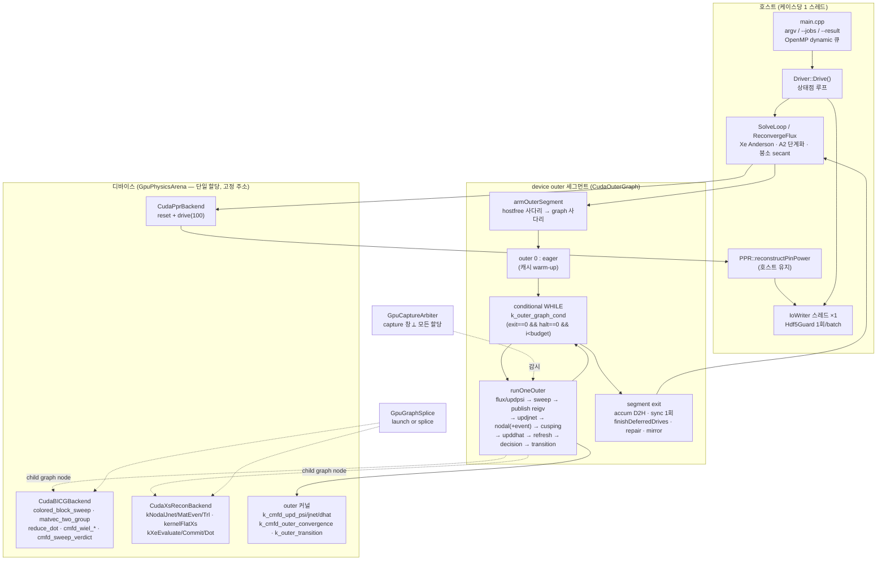

# GPU RASBERY — 계산 성능 · 병목 · 코드 구조 종합 보고 (2026-08-30)

**브랜치** `codex/exact-throughput-campaign` · **기준 팁** `c502856` · **v2 기준선** `fdef162`
**대상 덱** `kngr_238.json` — APR1400/KNGR CY1 PSAR 1주기, 35상태 자연 EOC, 1/4 노심 8,451 노드, NG=2
**기준기** MASTER (CPU) — 단일 27.2 s · W16 배치 217 case/h
**측정 호스트** 238(RTX PRO 6000 Blackwell sm_120, CUDA 13.0, Xeon Gold 5317 24코어, GPU0 전용) 및 로컬 WSL(GTX 1080 Ti sm_61, CUDA 12.6)

> 이 문서는 **기존 측정치의 정리**다. 새로운 실행을 포함하지 않는다. 모든 수는 커밋된 수신증·
> nsys 요약·문서화된 게이트 표에서 왔고, 각 표의 출처를 셀 옆에 적었다. 절대값이 로컬(1080 Ti)
> 인 표는 그렇게 표시했고, **로컬 값을 238에 옮겨 적지 않았다**.

---

## 목차

1. [요약 — 성능·정확도·상한](#1-요약--성능정확도상한)
2. [코드 구조](#2-코드-구조)
3. [성능 실측](#3-성능-실측)
4. [병목 원장과 각 레버가 하는 일](#4-병목-원장과-각-레버가-하는-일)
5. [정확성 게이트 체계](#5-정확성-게이트-체계)
6. [결함 기록](#6-결함-기록)
7. [남은 여지와 정직한 상한](#7-남은-여지와-정직한-상한)
8. [재현 명령과 문서 색인](#8-재현-명령과-문서-색인)

---

## 1. 요약 — 성능·정확도·상한

### 1.1 단일덱 (238 GPU0, `kngr_238.json` 35상태)

| # | 단계 | 도달 env | wall (s) | 직전 대비 | MASTER 27.2 s 대비 | 게이트 |
|---|---|---|---:|---:|---:|---|
| 0 | **MASTER (기준기, CPU)** | — | **27.2** | — | 1.00× | — |
| 1 | v2 동결 arm (호스트 Anderson Xe) | 기본값 | 55.4 | — | 0.49× | v2 동결 |
| 2 | + device outer 세그먼트 b8 | `RASBERY_GPU_OUTER=1 _SEGMENT_MAX=8` | **44.5** | 1.24× | 0.61× | **B0** |
| 3 | + 청크 Wielandt 접기 | `RASBERY_GPU_WIEL_FOLD=chunked` | **32.1** | 1.39× | 0.85× | **N1** |
| 4 | + device Xe Anderson | `RASBERY_GPU_XE=1` | **26.1** | 1.23× | 1.04× | **N1** |
| 5 | + **A2 단계화 허용오차** | `RASBERY_STAGED_FLUX_TOL=50 _XE_TOL=1000 _LOOSE_SETTLE=1` | **16.9** | 1.54× | **1.61×** | **N1(A2)** |

- 누적 **3.28× (55.4 → 16.9 s)**, MASTER 대비 **1.61×**.
- Σ outer **10,483 → 4,382** (−58.2 %). 상태점당 299.5 → 125.2.
- `docs/V3_FREEZE_20260829_KO.md` §4는 같은 arm을 **16.3 s = 1.67×**로 기록했다. 두 값은 다른
  측정일의 같은 arm이며, 이 문서는 **더 보수적인 16.9 s를 채택**한다(생산 프로파일링 실행 값,
  `docs/TASK10_OUTER_WHILE_20260901_KO.md` §7.4가 판정 기준으로 인용하는 그 값).

### 1.2 배치 M64 (238 GPU0, 64덱 재시작 함대)

| # | 단계 | case/h | 직전 대비 | MASTER W16 217 c/h 대비 |
|---|---|---:|---:|---:|
| 1 | v2 기준선 | **216** | — | 1.00× |
| 2 | + 청크 접기 | **245** | 1.13× | 1.13× |
| 3 | + device Xe Anderson | **322** | 1.31× | 1.48× |
| 4 | + A2 단계화 | **518 – 534** | 1.61 – 1.66× | 2.39 – 2.46× |
| 5 | + scalar-only 결과(`--result light`) | **577.6** | 1.09× | **2.66×** |

- 배치 골든 **708/708 데이터셋 Δ=0** (B0 arm).
- device outer 세그먼트는 **배치에서 중립**이다 — 224.5 vs 225.5 c/h (§4.3).
- 디스크 vs tmpfs **534.2 vs 533.9 c/h** — I/O는 writer 스레드가 이미 숨겼다(§3.6).

### 1.3 정확도 — 다섯 단계 전부 불변

| 지표 | v2 기준선 | v3 arm(5단계 전부) | 판정 |
|---|---:|---:|---|
| MASTER 대비 반응도 max | 1.905 pcm | **1.847 pcm** | 개선 |
| CBC max | 15.309 ppm | **15.334 ppm** | envelope 내 |
| AO | 0.013 | **0.012** | 개선 |
| BOC 핀 RMS / max | 0.238 % / 0.80 % | **0.238 % / 0.80 %** | 비열화 |
| EFPD 핀 추세 | — | **v2와 동일** | 비열화 |
| 결정론 | 4회 | **`[TRAJECTORY] digest = 0d15abf29d222a02` ×5** | PASS |

**정확도는 속도의 대가가 아니었다.** 다섯 단계 중 셋(N1)이 구성상 궤적을 움직이지만, 움직인
방향은 전부 MASTER **쪽**이었다. Xe Anderson 채택 때와 같은 구조다 — 기준선 쪽이 미수렴 Xe로
~2–3 pcm 인공오차를 내장하고 있었고, 후보가 그 고정점을 제대로 수렴시켰다
(`docs/CAMPAIGN_ANDERSON_WIDTH_FP32_20260827_KO.md` §8.2).

### 1.4 정직한 상한 (`docs/GPU_RASBERY_GA_EVALUATOR_PLAN_20260831_KO.md` §0.2, §4.3)

```text
현재 (238, M64, 1 GPU)              :   524 c/h  =  2.42× MASTER W16
공학 레버만 (L2·L4·L5, 전 충실도)   : 1,600 – 2,100 c/h = 7.4 – 9.7× MASTER
+ L3 (coarse 10상태, 충실도 레버)   : 3,600 – 4,700 c/h = 17 – 22× MASTER
```

- **aggregate 20×(4,340 c/h)는 GPU 8–10장이면 오늘의 기술로 도달한다** (524 × 8 × 0.85 = 3,563;
  10장이면 4,454). 새 물리가 필요 없다.
- **per-GPU 20×(한 장이 4,340 c/h)는 8.3× 개선이 필요하고 공학 상한을 넘는다.** 충실도 레버
  없이는 도달하지 않는다.
- 이 구분을 발표에서 흐리지 말 것 — 캠페인의 4,340 c/h 목표는 **aggregate 목표**다.

---

## 2. 코드 구조

### 2.1 규모

`fdef162..c502856` 145파일 / **+58,130 −1,257 줄**, 커밋 110개. `src/` 현재 **53,324줄**.

> **번호 체계가 둘이다 — 섞지 말 것.**
> `Rev.7.1` 계획의 **Task 0–28**과 **Wave W0 / W1 / W2 / W3 / W3.5 / W3.6 / W3.7 / W4-lite / W5+**는
> 구현 빌드 순서다(부록 D). GA evaluator 계획의 **L1–L8**은 **레버 번호**이고 그쪽 문서의
> **W1–W4**는 또 다른 웨이브 축이다. `docs/W4_L5_MULTIPROC_PER_GPU_20260901_KO.md`의 "L5"는
> **GA 계획의 레버 L5**(배치 폭·도착)이지 Rev.7.1의 웨이브가 아니며, 그 문서가 겨냥하는
> 것은 GA 계획 §5.5 / §6.2 Task 7이다. 이 보고서는 레버를 말할 때 **L1–L8**, 구현 순서를
> 말할 때 **Task n / W-n**을 쓴다.

### 2.2 서브시스템별 모듈 맵

#### (A) Driver / 케이스 오케스트레이션

| 파일 | 줄 | 역할 |
|---|---:|---|
| `src/main.cpp` | 1,026 | argv · `--jobs` 매니페스트 · `--result full\|pin-off\|light` · 배치 OpenMP `schedule(dynamic,1)` 큐 · `declareExecutionMode()` · refill 원장 |
| `src/Driver.h` | 4,455 | `Drive()` · `SolveLoop` · `ReconvergeFlux` · 호스트 Xe Anderson(m=2, 안전장치 4종) · A2 단계화(LOOSE/POLISH) · sptelem 계측 · `[TRAJECTORY]` digest · outer 훅 6종 |
| `src/Scheduler.h` | 672 | 상태점 스케줄, 임계붕소 secant 상태, per-deck 허용오차 |
| `src/EvaluatorContext.h` | 94 | **프로세스 수명 vs 케이스 수명**의 경계를 이름으로 고정(persistent evaluator 전제) |
| `src/BatchRefill.h` | 244 | 즉시 슬롯 리필 원장 + 테넌시 감사(`duplicates`/`stale_tenants`/`double_releases`) |
| `src/IO.cpp` / `.h` | 2,612 / 139 | 덱 파싱 · `ReadInput` · `AddResult` · restart |
| `src/IoWriter.h` | 871 | **HDF5 writer 스레드** — 호출 녹화/replay 프록시(`iowriter::Node`), 경계 MPSC FIFO |
| `src/OuterTrace.h`, `XSTiming.h`, `HostOuterBodyCounters.h` | 185 / 126 / 147 | 진단 계측 |

#### (B) CMFD / BiCGSTAB

| 파일 | 줄 | 역할 |
|---|---:|---|
| `src/BICGCMFD.cpp` / `.h` | 986 / 373 | CMFD outer 본문 · Wielandt · 스칼라 블록 스테이징 · `finishDrive` |
| `src/BICGSolver.cpp` / `.h` | 459 / 196 | BiCGSTAB 호스트 참조 |
| `src/CMFD.cpp` / `.h` | 254 / 301 | 연산자 조립 참조 |
| **`src/CudaBICGBackend.cu`** | **5,706** | **resident-single sweep 그래프 · 배치 rendezvous 아레나 · 청크 Wielandt 접기 · `cmfd_sweep_verdict`/`cmfd_sweep_patch` · `ScopedStreamCapture` · pinned 스테이징 레인** |
| `src/CudaBICGBackend.h` | 644 | 백엔드 인터페이스, sweep arm 선언 |
| `src/CmfdOuterKernel.h` | 596 | outer 경계 커널(순수 본문 — 호스트/디바이스 공유) |
| `src/CudaCmfdOuterKernels.h` | 473 | 그 본문의 디바이스 래퍼 |
| `src/CmfdAssemblyKernel.h` | 134 | 2군 연산자 조립 |
| `src/CmfdOuterReference.*`, `CmfdOuterFormMine.h`, `CmfdOuterFormMiner.cpp` | 242+134+164+73 | **수축 마스크 채굴**(`CMFD_OUTER_FORMS`) — 호스트별 자기 교정 |

#### (C) Nodal / XS 재구성

| 파일 | 줄 | 역할 |
|---|---:|---|
| `src/Nodal.cpp` / `.h` | 1,003 / 273 | SENM nodal 드라이브, `TryDriveGpu` 술어 |
| `src/NodalKernel.h` | 1,014 | 순수 nodal 본문 |
| `src/NodalConstantKernel.h` / `CudaNodalConstantKernel.h` | 292 / 360 | SENM 상수 (GPU 이식, Task 4) |
| **`src/CudaXsReconBackend.cu`** | **4,023** | **nodal 아레나 · canonical 버퍼 · `NodalGraphKey` 그래프 캐시 · FlatXS · Xe 커널** |
| `src/CudaXsReconBackend.h` | 509 | 백엔드 인터페이스, `waitOnSegmentEvent` |
| `src/FlatXsKernel.h` / `XsReconKernel.h` | 398 / 309 | 순수 본문 |
| `src/XeKernel.h`, `XeFormMask.h`, `XeFormMine.h`, `XeFormMiner.cpp`, `XeAndersonReference.*`, `XeGpuReceipt.h` | 426+26+178+57+186+76 | **device Xe Anderson** — 공유 대수 본문 + 채굴 수축 마스크 |
| `src/XSSet.cpp` / `.h` | 5,524 / 699 | 단면 집합, CRAM 감쇠, T/H, FlatXS |
| **`src/XsLibrary.h`** | 178 | **프로세스 공유 라이브러리 파싱 캐시** (`78e8c8b`) |

#### (D) Device outer 세그먼트 — 이 캠페인의 중심

| 파일 | 줄 | 역할 |
|---|---:|---|
| **`src/CudaOuterGraph.cu`** | **3,440** | `DeviceOuterSegmentState` 기계 · host-free 러너 · `runOneOuter` 람다 · repair pass · 거부 사다리 |
| **`src/CudaOuterGraph.h`** | **2,248** | 상태·수신증·훅 계약. 헤더 주석이 결함 이력의 1차 사료 |
| `src/GpuOuterWhile.h` | 379 | **conditional WHILE** — `k_outer_graph_cond` 정지 규칙, CUDA 13 `cudaGraphAddNode` 가드 |
| `src/GpuGraphSplice.h` | 176 | `graphLaunchOrSplice` — capture 중이면 launch 대신 child graph node로 splice |
| `src/GpuCaptureArbiter.h` | 296 | **capture 창과 모든 할당은 배타적**(shared_mutex 반전) |
| `src/GpuCanonicalState.h` | 392 | canonical jnet/phis/flux 선언 |
| `src/GpuFormMask.h` | 145 | 마스크 공통 |

#### (E) GPU 물리 아레나 / 위상 스케줄러

| 파일 | 줄 | 역할 |
|---|---:|---|
| `src/GpuPhysicsArena.h` / `GpuPhysicsArenaCuda.cu` | 144 / 604 | **단 하나의 device 할당**, 고정 주소. 그래프가 굽는 포인터가 절대 움직이지 않게 한다 |
| `src/GpuPhysicsArenaLayout.h` | 901 | 순수 호스트 레이아웃 계산기(CUDA 없이 단위 테스트) |
| `src/GpuPhysicsTypes.h` | 469 | 백엔드 중립 타입 |
| `src/GpuSlotControl.h` | 673 | per-slot device 제어 패킷 4종(케이스 상태 60필드) |
| `src/GpuPhaseScheduler.h` / `.cu` | 709 / 319 | 최소 케이스-위상 큐 + classify/compact (W0 범위) |
| `src/HostPinRegistry.h` | 723 | 호스트 page-lock 리스, 겹침 거부, 페이지 배타 |
| `src/CudaTransferMirror.h` | 51 | 바이트 미러 계상 |

#### (F) PPR (핀출력 재구성)

| 파일 | 줄 | 역할 |
|---|---:|---|
| `src/PPR.cpp` / `.h` | 1,182 / 219 | `reset` + `drive(100)` + `reconstructPinPower` |
| `src/CudaPprBackend.cu` / `.h` | 992 / 148 | **GPU PPR (`c502856`, `RASBERY_GPU_PPR`, 기본 OFF)** — `reset`+`drive` = PPR의 94.6 % 이식, `reconstructPinPower`는 호스트 유지 |

#### (G) 도구 · 계약

- **하네스**: `tools/run_single_gpu_batch.py`, `tools/run_multi_gpu_batch.py`(1,268줄 — GPU당
  프로세스, `--procs-per-gpu K`, MPS 수명주기, flock 공유 큐, VRAM 가드),
  `tools/ga_two_stage_40x_pipeline.py`, `tools/make_screening_deck.py`
- **판독기**: `tools/outer_profile.py`(outer 귀속·escape), `tools/case_cost_profile.py`(케이스 비용
  원장 — 모든 열이 수신증 필드 또는 두 수신증의 차), `tools/gate_a_compare.py`,
  `tools/compare_master_rasbery.py`, `tools/scheduler_trace_replay.py`
- **스파이크**: `tools/probe_dispatch_floor.cu`, `probe_gridsync_cost.cu`,
  `probe_conditional_graph.cu`(910줄), `probe_while_body_capture.cu`(787줄), `probe_l2_width.sh`
- **계약 테스트**: `tools/test_*.py` **약 60종**(정적 소스 계약 + 실행 게이트). 대표:
  `test_device_outer_exactness_contract.py`(1,326줄, 불변식 10),
  `test_device_outer_state_machine.py`(1,397줄), `test_graph_splice_contract.py`(규칙 10),
  `test_gpu_capture_arbiter_contract.py`, `test_staged_tolerance.py`,
  `test_telemetry_neutrality.py`, `test_batch_refill_contract.py`, `test_multi_gpu_dispatch.py`,
  `test_harness_env_parity.py`(하네스가 해석한 자식 환경 = 238 원시 생산 라인의 환경,
  `test/reference/batch_reference_env_238.json` 기준)
- **ctest 12종**: `test/*.cpp` / `*.cu` replay·probe 바이너리
  (`xsrecon_consistency`, `gpu_arena_layout`, `gpu_phase_compaction`, `nodal_constant_gpu_replay`,
  `cmfd_outer_form_probe`, `cmfd_outer_replay`, `xe_form_probe`, `canonical_state`,
  `outer_state_replay`, `nodal_constant_exp_probe`, `xsrecon_device_consistency`,
  `cmfd_outer_device_replay`)

### 2.3 데이터 흐름



**세 갈래의 제어 흐름 arm** (전부 bit 동일, wall만 다르다):

| arm | 호스트가 하는 일 | in-body host sync / outer | 수신증 |
|---|---|---:|---|
| OFF (호스트 outer) | 매 outer 본문을 호스트가 실행 | — | `segment_launches: 0` |
| 스트림 arm (`GPU_OUTER=1`) | outer마다 ~30개 enqueue 헬퍼 재발행, pass 꼭대기에서 exit word 관측 | 0.993 | `in_body_host_syncs 11,937` |
| 스트림 + `HOSTFREE_FULL` | exit 관측도 안 함 → 매번 budget 전부 enqueue, halt gate가 no-op화 | **0.086** | overrun 13,639 |
| **그래프 arm (`GPU_OUTER_GRAPH=1`)** | outer 0만 eager, 나머지는 device WHILE | **0** (그래프 세그먼트) | `graph_launches 3,144`, `iter/launch 2.66`, overrun **0** |

### 2.4 env 플래그 행렬

**규칙: 코드 기본값은 이 캠페인에서 하나도 바뀌지 않았다.** v3 arm의 다섯 구성요소는 전부
env로만 도달하며, env 없는 실행은 v2 궤적 그대로다. 롤백 = env 하나 삭제, 재빌드 불필요.

#### 생산 arm (v3)

| 플래그 | 기본 | 의미 | 게이트 등급 |
|---|---|---|---|
| `RASBERY_GPU` | off | CUDA 백엔드 전역 arm | — |
| `RASBERY_GPU_CMFD_SWEEP` | off | CMFD sweep을 GPU로 | B0 |
| `RASBERY_GPU_CMFD_RESIDENT_SINGLE` | off | S2 — 단일덱 CMFD 상주(같은 커널·같은 순서, 상주만 다름). 55.2 → 48.7 s | **B0** |
| `RASBERY_GPU_NODAL` / `_NODAL_FULL` | off | nodal 드라이브 GPU / 전 위상 | B0 |
| `RASBERY_GPU_XSRECON` / `_FLATXS` | off | XS 재구성 · FlatXS GPU (arm X) | B0 |
| `RASBERY_GPU_OUTER` | off | device outer 세그먼트 arm | **B0** |
| `RASBERY_GPU_OUTER_SEGMENT_MAX` | 1 | 세그먼트 budget (생산 8) | B0 |
| `RASBERY_GPU_WIEL_FOLD` | serial | `chunked` = 접기 범위 고정 분할 → 덧셈 결합 변경 | **N1** |
| `RASBERY_GPU_XE` | off | Xe Anderson 6개 내적을 `k_xe_dot_reduce` 고정 분할로 | **N1** |
| `RASBERY_STAGED_FLUX_TOL` | 1 | LOOSE 단계 flux/keff 허용오차 승수 (생산 50) | **N1(A2)** |
| `RASBERY_STAGED_XE_TOL` | 1 | LOOSE 단계 Xe 허용오차 승수 (생산 1000) | **N1(A2)** |
| `RASBERY_STAGED_LOOSE_SETTLE` | off | LOOSE 단계에서 `SEARCH_SETTLE_ITERS` 게이트 생략 | **N1(A2)** |
| `RASBERY_OMP_THREADS` | 자동 | 레인 하나가 솔버 영역에서 쓸 스레드 수 (238 단일 12) | — |

#### 채택된 기본값 (코드에 반영됨)

| 플래그 | 기본 | 비고 |
|---|---|---|
| `RASBERY_IO_WRITER` | **`thread`** | 전 모드. `inline`은 레거시(bisect·A/B용). 오타는 경고 후 기본값 |
| `RASBERY_XE_ANDERSON` | **단일 ON / 배치 OFF** | 모드 의존 기본값. 빈 값은 "요청 없음"이므로 **단일에서 ON**이다 — 배치 arm에서 켜려면 **명시적 export 필수** |

#### 아직 기본 OFF인 레버 (238 wall 대기)

| 플래그 | 기본 | 무엇을 하는가 | 상태 |
|---|---|---|---|
| `RASBERY_GPU_OUTER_HOSTFREE` | **ON** | sweep 관측을 세그먼트당 1회로 (`sync_pre_nodal` 12,017 → 504) | 채택됨 |
| `RASBERY_GPU_OUTER_HOSTFREE_FULL` | off | exit 관측까지 제거. in-body sync 0, 대신 overrun 13,639 | 진단용 |
| `RASBERY_GPU_OUTER_GRAPH` | off | **conditional WHILE.** in-body sync 11,937→1,038, overrun 0 | **238 wall이 기본값을 정한다** |
| `RASBERY_GPU_PPR` | off | PPR `reset`+`drive`를 디바이스로 (`c502856`) | 게이팅 중 (N1) |
| `RASBERY_XSLIB_CACHE` | on | 프로세스 공유 라이브러리 파싱 | 채택됨(`78e8c8b`) |
| `RASBERY_GPU_OUTER_BATCH_STREAM_SWEEP` | off | 배치에서 슬롯당 스트림 sweep | **폐기**(폭 붕괴, §4.3) |
| `RASBERY_GPU_CMFD_FP32` | off | FP32 inner + FP64 outer. M64 +2.6 % | 대역폭 바운드라 이득 작음 |
| `RASBERY_GPU_CAPTURE_ARBITER` | on | capture ⟂ 할당 직렬화 | 채택됨. `=0`은 계수만 남기고 직렬화 해제(A/B용) |

#### 계측 · 진단 (궤적 중립이 계약)

| 플래그 | 하는 일 |
|---|---|
| `RASBERY_STATEPOINT_TELEMETRY` | 위상별 wall + outer 귀속. **디제스트 밖**이며 `tools/test_telemetry_neutrality.py`가 중립성을 고정. **타이밍 실행과 섞지 말 것** |
| `RASBERY_OUTER_TRACE` / `_SP` | outer 단계별 해시. **그래프 arm을 거부**한다(body 안에서 device 메모리를 동기 읽기) |
| `RASBERY_GPU_CAPTURE_TRACE` / `_STALL_US` | capture 창 추적 / 인위 확장(결함 재현) |
| `RASBERY_CMFD_OUTER_FORMS`, `RASBERY_XE_FORMS`, `RASBERY_NODAL_CONST_FORMS` | 채굴 수축 마스크 덮어쓰기 |
| `RASBERY_BATCH_LIGHT_RESULT` / `--result light` | scalar-only 출력. `RASBERY_ALLOW_SCREENING=1` 필요 |
| `RASBERY_BATCH_HOST_THREADS`, `RASBERY_BATCH_WAIT_US` | 리필 레인 수, rendezvous 도착 대기 |

---

## 3. 성능 실측

### 3.1 커널 시간 — 배치 M64 (238, nsys `cuda_gpu_kern_sum`, 180 s 창)

`scratchpad/trace238/profile_feff7e7/m64_prod_nsys_summary.txt`

| # | 커널 | 시간 % | 총 시간 (s) | 인스턴스 | 평균 | 서브시스템 |
|---:|---|---:|---:|---:|---:|---|
| 1 | `kernelFlatXs` | **39.9** | 40.41 | 13,118 | 3.08 ms | XS 재구성 |
| 2 | `kXeEvaluate` | **14.4** | 14.53 | 62,698 | 232 µs | Xe Anderson |
| 3 | `kXeCommit` | **11.1** | 11.28 | 46,232 | 244 µs | Xe Anderson |
| 4 | `colored_block_sweep` | **9.1** | 9.25 | **1,593,664** | **5.80 µs** | CMFD sweep |
| 5 | `kNodalJnet<1>` | 4.7 | 4.78 | 37,045 | 129 µs | Nodal |
| 6 | `kNodalMatEven<1>` | 2.8 | 2.82 | 37,045 | 76 µs | Nodal |
| 7 | `matvec_two_group` | 2.6 | 2.60 | 398,416 | 6.51 µs | BiCGSTAB |
| 8 | `reduce_dot_stage1` | 2.5 | 2.51 | 647,426 | 3.88 µs | BiCGSTAB |
| 9 | `update_solution` | 1.5 | 1.48 | 199,208 | 7.43 µs | BiCGSTAB |
| 10 | `prepare_p_jacobi` | 1.1 | 1.16 | 199,208 | 5.81 µs | BiCGSTAB |
| 11 | `kXeDotStage2` | 1.1 | 1.16 | 27,338 | 42.3 µs | Xe |
| 12 | `reduce_dot2_stage1` | 1.0 | 1.05 | 199,208 | 5.26 µs | BiCGSTAB |
| 13 | `update_s_jacobi` | 1.0 | 0.99 | 199,208 | 4.95 µs | BiCGSTAB |
| 14 | `begin_outer_fused` | 0.9 | 0.96 | 49,802 | 19.2 µs | CMFD outer |
| 15 | `kNodalTrl12<1>` | 0.8 | 0.84 | 37,045 | 22.7 µs | Nodal |
| 16 | `reduce_dot_stage2` | 0.8 | 0.78 | 398,416 | 1.96 µs | BiCGSTAB |
| 17 | `cmfd_assemble_operator_2g` | 0.6 | 0.63 | 9,231 | 68.6 µs | CMFD 조립 |
| — | 나머지 18종 (`cmfd_wiel_*`, `cmfd_updls`, `cmfd_negative_scan`, `kXeSub/Candidate`, `finalize_status`, …) | 3.9 | ~3.9 | — | — | — |

**서브시스템 집계 (배치)**

| 서브시스템 | 시간 % | 판독 |
|---|---:|---|
| XS 재구성 (`kernelFlatXs`) | **39.9** | 단일 커널이 GPU 시간의 40 %. 인스턴스는 13,118뿐이고 **평균 3.08 ms** — 큰 커널이다 |
| Xe Anderson (`kXe*`) | **26.9** | Evaluate+Commit+Dot+Sub+Candidate |
| CMFD/BiCGSTAB inner | **~19** | `colored_block_sweep` 9.1 + matvec/reduce/update 계열 ~10 |
| Nodal | **8.6** | Jnet+MatEven+Trl |
| CMFD outer 경계 | **~3** | `begin_outer_fused`, `cmfd_wiel_*`, `cmfd_updls`, `cmfd_src_build` |

### 3.2 커널 시간 — 단일 생산 실행 (238, nsys)

`scratchpad/trace238/profile_feff7e7/single_prod_nsys_summary.txt`

| # | 커널 | 시간 % | 총 시간 (s) | 인스턴스 | 평균 |
|---:|---|---:|---:|---:|---:|
| 1 | `colored_block_sweep` | **23.7** | 1.562 | **701,056** | 2.23 µs |
| 2 | `kernelFlatXs` | **14.4** | 0.948 | 384 | 2.47 ms |
| 3 | `reduce_dot_stage1` | 10.6 | 0.701 | 284,804 | 2.46 µs |
| 4 | `matvec_two_group` | 5.7 | 0.376 | 175,264 | 2.15 µs |
| 5 | `reduce_dot_stage2` | 4.9 | 0.325 | 175,264 | 1.85 µs |
| 6 | `reduce_dot2_stage1` | 4.0 | 0.265 | 87,632 | 3.02 µs |
| 7 | `reduce_norm_accumulate_stage2` | 3.5 | 0.232 | 87,632 | 2.65 µs |
| 8 | `prepare_p_jacobi` | 3.2 | 0.209 | 87,632 | 2.38 µs |
| 9 | `update_s_jacobi` / `update_solution` | 2.9 / 2.9 | 0.194 / 0.192 | 87,632 | ~2.2 µs |
| 10 | `kNodalJnet<0>` | 2.9 | 0.189 | **4,382** | 43.2 µs |
| 11 | `kXeEvaluate` | 2.7 | 0.177 | 1,567 | 113 µs |
| 12 | `kXeCommit` | 2.2 | 0.146 | 1,124 | 129 µs |
| 13 | `kNodalMatEven<0>` | 1.5 | 0.096 | 4,382 | 22.0 µs |
| — | device outer 커널 6종 (`k_cmfd_upd_psi/jnet/dhat`, `k_outer_transition`, `k_cmfd_outer_convergence`, `k_outer_refresh_inputs`, `k_outer_publish_reigv`) | **1.0 합계** | 0.062 | 각 4,382 | 1.2–5.7 µs |

**`reduce_dot` 계열 합계 15.5 %** (stage1 10.6 + stage2 4.9). `kNodalJnet` 인스턴스 4,382 =
**outer 수**이며, A2 이후의 outer 수(4,382)를 커널 인스턴스가 직접 확인해 준다.

**단일과 배치의 프로파일이 다르다는 것이 핵심이다.**

| | 단일 | 배치 M64 |
|---|---|---|
| 1위 커널 | `colored_block_sweep` 23.7 % (2.23 µs × 701 k) | `kernelFlatXs` 39.9 % (3.08 ms × 13 k) |
| 지배 항 | **작은 커널의 수** — 발사 지연 바운드 | **큰 커널의 grid** — 선언 폭 비용 |
| 처방 | 발사 제거(그래프/WHILE) | 폭 채움(compaction / K-프로세스) |

### 3.3 CUDA API — 단일 실행 (238, nsys `cuda_api_sum`)

| # | API | 시간 % | 총 시간 (s) | 호출 수 | 평균 | 최대 |
|---:|---|---:|---:|---:|---:|---:|
| 1 | **`cudaMemcpyAsync`** | **49.3** | **5.075** | **117,829** | 43.1 µs | 4.92 ms |
| 2 | `cudaGraphLaunch` | 24.0 | 2.470 | 9,050 | 273 µs | 3.96 ms |
| 3 | `cudaStreamSynchronize` | 21.0 | 2.163 | 16,453 | 131 µs | 4.66 ms |
| 4 | `cudaLaunchKernel` | 2.6 | 0.266 | 52,514 | 5.06 µs | 1.28 ms |
| 5 | `cudaGraphInstantiate` | 1.1 | 0.109 | 1,404 | 77.4 µs | 3.10 ms |
| 6 | `cudaMalloc` | 0.9 | 0.089 | 79 | 1.13 ms | 88.0 ms |
| 7 | `cudaMemsetAsync` | 0.3 | 0.031 | 9,076 | 3.47 µs | — |
| 8 | `cudaGraphExecDestroy` | 0.2 | 0.026 | 1,404 | 18.3 µs | — |
| 9 | `cudaHostRegister` / `Unregister` | 0.1 / 0.1 | 0.011 / 0.006 | 69 / 69 | 163 / 88 µs | — |
| 10 | `cudaStreamBeginCapture` / `EndCapture` | 0.0 | 0.004 / 0.002 | 1,404 / 1,404 | — | — |

**이 표가 단일덱 병목의 전부다.** GPU 커널 총합은 6.6 s인데 API 총합은 10.3 s이고, 그중
**절반이 `cudaMemcpyAsync` 11.8만 회**다. `cudaGraphInstantiate` 1,404회 × 77 µs = 0.109 s는
그래프 캐시가 아직 완전히 안정되지 않았다는 뜻이며(`nodal_graphs` 캐시 상한 8), 같은 수의
`GraphExecDestroy`/`BeginCapture`/`EndCapture`가 그 짝이다.

### 3.4 OS 런타임 — 배치 M64 (238, nsys `osrt_sum`)

| # | 호출 | 시간 % | 총 시간 | 호출 수 | 중앙값 |
|---:|---|---:|---:|---:|---:|
| 1 | **`pthread_cond_wait`** | **72.6** | 6,969 s(스레드 합) | 885,373 | 2.86 ms |
| 2 | **`pthread_mutex_lock`** | **17.6** | 1,687 s | 245,152 | 20.2 µs |
| 3 | `poll` | 3.7 | 358 s | 3,536 | 100 ms |
| 4 | `sem_wait` | 3.7 | 352 s | 140 | 609 ms |
| 5 | `pthread_cond_timedwait` | 2.3 | 218 s | 27,169 | 667 µs |
| 6 | `writev` | 0.1 | 5.41 s | 515,292 | 7.0 µs |
| 7 | `pwrite` | 0.0 | 3.74 s | 18,035 | 7.7 µs |

**osrt의 90.2 %가 뮤텍스와 조건변수다.** 이것이 L5(GPU당 K 프로세스)의 근거 전부다.

### 3.5 GPU 점유 (238, `nvidia-smi dmon`)

| 실행 | SM % 평균 | p50 | p90 | 최대 | 메모리 % 평균 | p50 | 최대 |
|---|---:|---:|---:|---:|---:|---:|---:|
| **배치 M64** (n=384) | **62.05** | 76 | 87 | 96 | **6.94** | 8 | 16 |
| 단일 (n=40, 활성 구간 ~18 s) | — | ~60 | — | **82** | — | 1 | 2 |

**GPU 유휴 간극 (>50 µs, 전 GPU trace 이벤트, 배치 M64)**

| n | p50 | p90 | 최대 | 합계 |
|---:|---:|---:|---:|---:|
| 10,127 | 117.2 µs | 701.5 µs | 93.1 ms | **3.047 s / 180 s (1.7 %)** |

**해석**: 유휴 간극의 총합은 작다(1.7 %). 즉 GPU는 "비어 있어서" 62 %인 것이 아니라 **선언 폭
64에 대해 실제로 도착한 폭이 14.5뿐이어서** SM이 채워지지 않은 것이다. 메모리 처리량 7 %가
이를 확증한다 — 커널은 대역폭에 걸려 있지 않고, **grid의 대부분이 빈 슬롯을 계산한다.**

### 3.6 케이스 비용 모델

`tools/case_cost_profile.py`가 접는 원장. 케이스 하나는 네 버킷이다.

```text
t_case ≈ T_process + T_percase + N_sp × c + N_outer × d
         (프로세스)  (Init+IO)   (상태점 바닥)  (outer 본문)
```

| 계수 | 로컬 (1080 Ti, GA 계획 §2.2) | **238 (실측)** |
|---|---:|---:|
| `c` — 상태점당 호스트 바닥 | 0.474 s | **0.343 s** (단일) / **2.64 s** (M64, 케이스당) |
| `d` — outer당 | 4.805 ms | **1.714 ms** (단일) / **26.6 ms** (M64) |
| 회귀 rms | 0.100 s (n=35) | — |
| `T_process` — 프로세스 기동+CUDA 컨텍스트+teardown | 2.0 s | 배치에서는 프로세스당 1회 |
| `T_percase` — `Init+IO` | 1.1 s | **0.9 → 44.9 s 계단**(M64, XSLIB 캐시 이전) |

**두 독립 덱이 같은 두 계수를 준다** (35상태 `t_sp = 0.474 + 4.805 ms × outer`;
10상태 coarse `t_sp = 0.538 + 4.720 ms × outer`, rms 0.044 s). 이것이 이 캠페인이 지금까지
갖지 못했던 케이스 비용 모델이다.

> **출처 주의.** `docs/GPU_RASBERY_GA_EVALUATOR_PLAN_20260831_KO.md`에 실린 `(c, d)` fit은
> **둘 다 로컬 1080 Ti 값**이며, 그 문서는 238 fit을 §6.1 Task 1의 **최우선 미실행 과제**로
> 남겨 두었다. 위 표의 238 열은 **그 이후에 얻은 238 실측치**이고 아직 GA 계획에 반영되지
> 않았다 — 이 보고서가 처음 기록한다. 다음 GA 계획 개정이 §2.2와 §4를 이 값으로 다시 써야
> 한다. `d`의 238 값 1.714 ms가 로컬 4.805 ms의 2.8배 빠른 반면 `c`는 0.343 vs 0.474 s로
> 1.4배밖에 빠르지 않다는 것이 GA 계획이 예상한 그대로다(**GPU는 빨라지고 CPU는 그만큼
> 빨라지지 않는다**) — 즉 **상태점 호스트 바닥의 상대 비중이 238에서 더 크다**.
> 238 단일: `35 × 0.343 + 4,382 × 0.001714 = 12.0 + 7.5 = 19.5 s`, 실측 16.9 s와 같은 자릿수이며
> **바닥이 outer 본문보다 크다**. 이것이 GPU PPR(`c502856`)의 우선순위 근거다.

`d`의 독립 검증(로컬): `RASBERY_GPU_OUTER=0` + `RASBERY_OUTER_TIMING=1` arm의 위상 합
**4.428 ms/outer**가 회귀 기울기 **4.805 ms/outer**와 일치한다(차 0.38 ms = Xe 갱신·수렴
판정·탐색 산법). **회귀 계수 `d`는 outer 본문 비용 그 자체다.**

**로컬 케이스 원장 (1080 Ti, v3 arm, 35상태)**

| 버킷 | 초 | 성격 |
|---|---:|---|
| `outside_drive` (프로세스 이미지 + CUDA 컨텍스트 exit) | **2.0** | 프로세스당. `main` 안의 어떤 코드도 되돌릴 수 없다(`12052df`) |
| `Init+IO` (ReadInput + 솔버 생성 + 아레나 admission + OpenResult) | **1.1** | 케이스당. 그중 `library_seconds` 0.28–0.45 s |
| **상태점 바닥** (PPR / CRAM depletion / FlatXS / T-H — **전부 CPU**) | **16.6** | 케이스당, 진짜 계산 |
| **outer 본문** | **22.1** | 케이스당, 진짜 계산 |
| `io` (드라이버 스레드 charge) | **2.6** | `--result light`가 0.43 s로, 핀출력 OFF가 0.05 s로 |
| 합 | **41.8** (실측 41.9–44.7) | |

**상태점 바닥 16.6 s의 내부** (`floor_wall` 수신증, `src/CudaPprBackend.h` 헤더 주석)

| 항목 | 초 | ms/상태점 | PPR 내 비중 |
|---|---:|---:|---:|
| `ppr_reset` | 0.560 | 15.99 | 10.1 % |
| **`ppr_drive`** | **4.676** | **133.60** | **84.5 %** |
| `ppr_recon` | 0.297 | 8.48 | 5.4 % |
| **PPR 합계** | **5.532** | **158.07** | **바닥의 ~50 %** |

나머지 ~50 %는 CRAM Bateman 감쇠(predictor/corrector, 8,451노드 전부), FlatXS 갱신, T/H,
결과 packing이다. `c502856`의 GPU PPR은 `reset`+`drive`(PPR의 94.6 %)를 이식했다.

**outer 본문 22.1 s의 내부** (SPTELEM 위상 분해, 로컬)

| 위상 | 비중 |
|---|---:|
| `drive` (CMFD sweep = BiCGSTAB) | **63 %** |
| `nodal` (SENM) | **22 %** |
| `upddhat` | **8 %** |
| `updjnet` | **6 %** |
| `updpsi` / `setls` / `cusping` | ~1 % |

**outer의 원인 귀속** (A2 후보, `tools/outer_profile.py`)

| 원인 | outer | 비중 | 케이스당 초 | 의미 |
|---|---:|---:|---:|---|
| **`xe`** (평형-Xe 캐스케이드 재수렴) | 3,184 | **69.0 %** | 15.3 | 붕소 trial·T/H 갱신마다 재장전. **최대 단일 항** |
| `search` (임계붕소 secant) | 707 | 15.3 % | 3.4 | trial 137회 |
| `initial` | 347 | 7.5 % | 1.7 | warm-start(L8)가 겨냥하는 버킷 |
| `settle` | 290 | 6.3 % | 1.4 | 탐색 표본 게이트 (기준 1,020) |
| `th` | 86 | 1.9 % | 0.4 | |
| `fallback` | 0 | 0 % | 0 | 탐색이 한 번도 최선점 복귀를 하지 않았다 |

### 3.7 폭 스윕 — 배치 아레나 (238)

| 폭 | c/h | mean rendezvous width | width_fill | 판정 |
|---|---:|---:|---:|---|
| **M64** (생산) | **518 – 534** (light 577.6) | **14.5 / 64** | **0.227** | 채택 |
| M96 | 516 | — | — | 이득 없음 |
| M128 | flat | **11.6** (14.5에서 하락) | — | **기각** |

- 폭을 늘리면 **평균 rendezvous 폭이 오히려 떨어진다** (14.5 → 11.6). 호스트 24코어가
  경합하면서 도착 폭이 좁아지기 때문이다.
- 이전 세대 측정(Anderson 캠페인 §4, 다른 기준선)에서도 같은 구조가 나왔다: 폭 96 + BASE
  **77.4 c/h (−62 %)**, 폭 96 + AA1 187.4 c/h. **커널 grid는 선언 폭에 비례하고 유용한 일은
  달성 폭에 비례한다** — 이것이 폭 확장을 기각한 이유이며, 지금도 유효하다.

### 3.8 I/O

| 측정 | 결과 | 출처 |
|---|---|---|
| writer 스레드 채택 근거 | 시도한 **모든 구성에서 byte-identical**(단일 500/500, M64 **45,312/45,312** 데이터셋), M64 **+0.6 %** | `IO_WRITER_THREAD_DESIGN_20260827_KO.md` |
| SPTELEM `io_wall` (단일덱, 로컬) | 0.0151 s → **0.0018 s** | 같은 문서 §2 |
| SPTELEM `io_wall` (M64, writer 이전) | 단일덱 ~3 % → **~40 %/케이스** | `CAMPAIGN_ANDERSON_…` §3 |
| **디스크 vs tmpfs (238, M64)** | **534.2 vs 533.9 c/h** | 238 실측 — **I/O는 완전히 숨겨졌다** |
| 단일 실행 `[HDF5][LOCK]` | `acquires: 40, wait_ms: 0.0056` | `trace238/on1_trace.stdout.log` |
| 단일 실행 `[IO_WRITER][SUMMARY]` | `ops 819, bytes 182 MB, max_queue_depth 1, enqueue_block_ms 0, writer_busy_ms 104` | 같은 로그 |
| **결과 크기** | full `result.h5` 182.56 MB + CSV 119.01 MB = **301.6 MB/케이스** → light **25.1 kB** | `948d111` |
| **웨이브당** | **17 GB → 2.6 MB** | 238 실측 |
| 궤적 동일성 | full / pin-off / light 세 모드 **digest `814201df…` 동일** | `948d111` |

`--result`는 **출력 형태 스위치이지 충실도 스위치가 아니다.** 세 모드 모두 같은 solve와 같은
PPR을 돌린다(Fq/FΔH는 PPR 산출물이고 GA가 둘 다 읽는다). `pin-off`는 **인쇄**를 멈출 뿐
재구성은 그대로 돈다.

---

## 4. 병목 원장과 각 레버가 하는 일

### 4.1 병목의 계층 — 단일덱

| 층 | 증상 | 수치 | 레버 | 상태 |
|---|---|---|---|---|
| **1. outer 수** | 상태점당 299.5 outer, MASTER는 ~59 | 10,483 총 | Xe Anderson(호스트/GPU), **A2 단계화** | **완료** → 4,382 (125.2/상태) |
| **2. 호스트 왕복** | outer마다 ~30개 enqueue + `cudaStreamSynchronize` | `cudaMemcpyAsync` 117,829회 = API의 49 % | device outer 세그먼트 → host-free → **conditional WHILE** | 세그먼트 채택, WHILE **미가격(238 대기)** |
| **3. 작은 커널의 수** | `colored_block_sweep` 701,056회 × 2.23 µs | 커널 시간의 23.7 % | 그래프 캡처(발사 제거), sweep 언롤 | 부분 |
| **4. 상태점 호스트 바닥** | PPR/CRAM/FlatXS/TH 전부 CPU | 케이스의 40 %+ (로컬 16.6 s/41.8 s) | **GPU PPR** (`c502856`) | 게이팅 중 |
| **5. 프로세스 비용** | 기동+CUDA 컨텍스트+exit | 2.0 s/케이스 | persistent evaluator (L2) | 계획됨 |

### 4.2 병목의 계층 — 배치 M64

| 층 | 증상 | 수치 | 레버 | 상태 |
|---|---|---|---|---|
| **1. 도착 폭** | 선언 64, 도착 14.5 | `width_fill` **0.227** | slot compaction (W4) / **GPU당 K 프로세스 + MPS** (L5) | compaction 미착수, L5 하네스 완료·238 미측정 |
| **2. 호스트 락** | osrt의 90 %가 뮤텍스/cv | `pthread_cond_wait` 72.6 %, `mutex_lock` 17.6 % | 같은 L5 (아레나·랑데부·뮤텍스가 전부 프로세스 싱글턴) | 하네스 완료 |
| **3. 큰 커널의 grid** | `kernelFlatXs` 39.9 %, 평균 3.08 ms | SM 62 %, 메모리 7 % | 폭 채움 (위 1·2와 같은 것) | — |
| **4. 라이브러리 파싱 직렬화** | 64덱이 같은 34 MB를 64번, 한 번에 하나씩 | `Init+IO` 0.9 → **44.9 s** 계단 | **XSLIB 호스트 캐시** (`78e8c8b`) | **완료**, 238 미가격 |
| **5. I/O** | (해소됨) | 디스크 vs tmpfs **534.2 vs 533.9** | writer 스레드 (채택 기본값) | **종결** |

### 4.3 각 레버가 병목에 한 일

| 레버 | 커밋 | 병목 대상 | 측정된 효과 |
|---|---|---|---|
| S2 resident-single | `d773f23` | 재-스테이징 | 55.2 → 48.7 s, bit 동일 (644/644) |
| device outer 세그먼트 | `0ab3644`+`4549d71`+ | 호스트 왕복 | 단일 55.4 → 44.5 s. **배치는 중립** (224.5 vs 225.5 c/h) |
| 청크 Wielandt 접기 | `317c326` | 직렬 접기 | 단일 44.5 → 32.1 s |
| device Xe Anderson | `f630086`+`ef4104f` | Xe 내적 6종 | 단일 32.1 → 26.1 s. 로컬 outer 4,614 → 4,602 (−0.26 %) — **wall 이득은 커널 쪽이지 outer 쪽이 아니다** |
| **A2 단계화 허용오차** | `88f7018`+`4c3e2a6` | **outer 수** | **로컬 12,017 → 4,614 (−61.6 %), 62.2 → 33.0 s (1.88×)**; 238 단일 26.1 → 16.9 s. 캐스케이드 수는 **불변(228)**, 스텝만 10.65 → 5.24 |
| host-free outer | `1535daf`+`984e4ca` | 호스트 동기화 | `sync_pre_nodal` **12,017 → 504 (−96 %)**, in-body sync 23,432 → 11,937 |
| **conditional WHILE** | `d89fb1c`+`f791f75` | 호스트 왕복 잔여 | in-body sync **11,937 → 1,038**, overrun **21 → 0**, `graph_launches` 3,144 / `iter/launch` 2.66 / `instantiations` **1** / `warmup_misses` **0**. **238 wall 미측정** |
| nodal 그래프 캐시 | `feff7e7` | 세그먼트당 재캡처 | `graph_captures` **3,282 → 4**. 재캡처마다 딸려 있던 `cudaStreamSynchronize`(어떤 수신증에도 없던 host rendezvous)가 함께 사라짐 |
| pinned sweep 스테이징 | `f791f75` | pageable async copy | H2D/D2H가 **실제로 비동기**가 되고 capture에 기록 가능해짐 |
| **XSLIB 호스트 캐시** | `78e8c8b` | 배치 라이브러리 파싱 | 로컬 8워커 `Init+IO` 계단 0.575→2.678 s 평탄화, `[HDF5][LOCK].wait_ms` **9,317 → 0** |
| **L5 K-프로세스/GPU** | `c34c37a` | 도착 폭 + 호스트 락 | 로컬 K=2: c/h **+25 % ~ +69 %**, `width_fill` 0.305 → **0.423 (+39 %)**. **238 미측정** |
| writer 스레드 | (v2 이전) | 배치 I/O | `io_wall` 40 % → 숨겨짐. M64 +0.6 %, byte-identical |
| GPU PPR | `c502856` | 상태점 바닥 | PPR의 94.6 % 이식 (바닥의 ~47 %). **게이팅 중** |
| `--result light` | `948d111` | 출력 크기 + 배치 I/O | 301.6 MB → 25.1 kB/케이스; M64 518–534 → **577.6 c/h** |

### 4.4 폐기된 레버 — 그리고 왜

| 레버 | 무엇을 기대했나 | 무엇이 나왔나 | 판정 |
|---|---|---|---|
| **배치에서 budget 8** (`GPU_OUTER_BATCH_STREAM_SWEEP`) | outer i+1을 호스트 복귀 없이 | **폭 M의 launch 1개가 폭 1의 launch M개로.** 238 M64 **5.6× 회귀**(> 2× wall, 미완주). 로컬 M16 1.43×, M8 1.17× — **M에 대해 단조 증가** | **기본값 철회** (`6eb5917`), opt-in만 존치. **폭 M·budget 1**과 **폭 1·budget 8**은 배타적이고 M이 크면 폭이 이긴다 |
| **아레나 폭 96/128** | 더 많은 동시 덱 | 폭 96 + BASE **77.4 c/h (−62 %)**; M128 flat, 평균 폭 14.5 → 11.6 | **기각.** 실점유가 그대로인 채 폭만 키우면 빈 슬롯 비용을 **전 커널**이 낸다 |
| **interim-Xe** (Task 13a) | outer 감축 | 임계 1e-3/1e-4/1e-5에서 **+31.9 % / +19.3 % / +47.8 %** 악화. AA 제안 수 1,472 → 664 붕괴 | **NO-GO, 구조적.** interim 스텝은 미수렴 flux 위에서 발화하고 그것은 Anderson이 외삽하는 사상의 점이 아니다. Anderson 채택 **이전에 설계된** 태스크 |
| **FP32 혼합정밀** | 시간 절반 | M64 **+2.6 %** | 채택하되 이득 미미. 커널이 **0.13 FLOP/B 대역폭 바운드**라 정밀도 절반 ≠ 시간 절반 |
| **persistent 커널 스케줄러** (Rev.7 §5.7) | 상주 위상 스케줄러 | W0 실측 `c_barrier = 0.78 µs` vs kill 문턱 0.384 µs | **영구 폐쇄** |
| 배치 Anderson (기본) | outer −38 %를 처리량으로 | 202 vs 216 c/h — **도착 폭 기아** | **배치 기본 OFF.** 잡당 outer가 줄면 랑데부 안에 동시에 있는 잡 수가 줄고, 빈 슬롯 비용을 전 커널이 낸다 |

---

## 5. 정확성 게이트 체계

### 5.1 등급 정의

| 등급 | 주장 | 요구 게이트 |
|---|---|---|
| **B0** | 이전 경로와 **비트가 같다** | feature-off byte 동일성(`h5diff` 전 데이터셋 Δ=0) + 결정론 ×2 + `[TRAJECTORY] digest` 일치. **Gate A/B 불필요** |
| **N1** | 부동소수 **결합 순서**가 바뀐다(알고리즘은 동일) | **Gate A**(v2 궤적 대비 이동 **크기** 보고) + **Gate B**(MASTER **쪽으로** 갔는지) + 구성요소별 추가 게이트 |
| **A2** | 수렴 **도중** 무엇으로 수렴하는지가 바뀐다(발행되는 답은 생산 허용오차에서만) | N1 전부 + 불변식 계약(`test_staged_tolerance.py`) + `staged_relapses` 보고 |

**B0와 N1의 차이는 신뢰도가 아니라 게이트다.** Gate A의 델타는 N1에서 0이 아닐 것으로
**예상되며**, 그것이 MASTER 쪽인지 반대쪽인지는 **Gate B만이** 답한다.

### 5.2 골든 데이터셋 수

| 골든 | 데이터셋 수 | 비고 |
|---|---:|---|
| 단일덱 (v1/v2 기록) | **500** | v2 매니페스트 |
| 단일덱 (로컬 트리 실측, 2026-08-29) | **644** | `h5diff -c -v`가 실제로 세는 수 |
| 배치 M64 | **708** | B0 arm 708/708 Δ=0 |
| 배치 M64 (writer 게이트) | **45,312** | 64덱 × 708 |

> **미해결 항목**: 644개를 담은 파일에 대해 "0/500"이라고 인용한 게이트는 **144개를 보지 않은
> 게이트**다. v3 동결 실행은 238이 실제로 비교하는 수를 기록해야 한다
> (`V3_FREEZE_20260829_KO.md` §4.1).

### 5.3 v3 arm의 구성요소별 등급

| 구성요소 | env | 등급 | 게이트 결과 |
|---|---|---|---|
| S2 resident-single | `_CMFD_RESIDENT_SINGLE=1` | **B0** | bit 동일 644/644, 55.2 → 48.7 s |
| device outer 세그먼트 | `_GPU_OUTER=1 _SEGMENT_MAX=8` | **B0** | feature-off byte 동일성 |
| 청크 Wielandt 접기 | `_WIEL_FOLD=chunked` | **N1** | Gate A + Gate B + `[WIEL_FOLD] mode/source` 수신증 필수 |
| device Xe Anderson | `_GPU_XE=1` | **N1** | Gate A/B + **수용률 ±10 pp**(v2 95.0 %) + `[XE_GPU] host_fallbacks=0` |
| A2 단계화 | `_STAGED_*` | **N1(A2)** | Gate A/B + `staged_relapses` (실측 **0**) |
| GPU PPR | `_GPU_PPR=1` | **N1** | Gate A(핀출력 max 상대차, Fq/FΔH) + `ppr_host_calls=0`. `exp`가 device libm이고 코너합이 256청크 고정 분할이라 **bit 동일이 아니다** |

### 5.4 궤적 디제스트 — 실행이 자기 arm을 증명한다

```
[RASBERY][TRAJECTORY] {"schema_version":1,"slot":0,"statepoints":35,"outers":4382,
  "th_updates":126,"digest":"0d15abf29d222a02","telemetry":0,
  "env":{"RASBERY_GPU_XE":"1","RASBERY_STAGED_FLUX_TOL":"50",...}}
```

- `digest` — 상태점별 (step, outer, T/H, efpd·k_eff·붕소의 **비트 패턴**)의 접기. 요약이 아니라
  궤적 자체다. outer 하나 또는 k_eff 마지막 비트가 움직인 실행은 일치하지 않는다.
- `env` — 궤적을 움직일 수 있는 모든 knob의 **원시 문자열**. 해석하지 않는 것이 요점이다.
- `telemetry` — **디제스트 밖**. 이 분리가 계기 중립성 게이트를 가능하게 한다.

**측정된 디제스트**

| arm | digest | outers | 반복 |
|---|---|---:|---:|
| 238 생산 v3 arm | `0d15abf29d222a02` | 4,382 | **5회 동일** |
| 로컬 base arm (Task 10 게이트 전체) | `78e58de0db8b4484` | 12,017 | **11–12개 run 전부 동일** |

### 5.5 계기 중립성 (신규 게이트)

`RASBERY_STATEPOINT_TELEMETRY`의 소비자는 정확히 둘이며(`outer_timing::Scope`,
`Drive()`의 `sp_telem`), 어느 쪽도 정착 게이트가 읽는 다섯 값(`has_search`,
`schedule.searchType`, `staged_loose_settle`, `polishing`, `clean_iters`)을 쓰지 않는다.
`ctx.telemetry.*`는 전부 `++`/`+=`이며 **어디에서도 읽히지 않는다**.

로컬 8개 arm 전부 중립 확인:

| arm | telemetry OFF | ON | h5 |
|---|---:|---:|---|
| base | 12,017 | 12,017 | 644/644 동일 |
| CAND, host Xe, OUTER on/off | 4,614 | 4,614 | 동일 |
| CAND, GPU Xe, OUTER on/off | 4,602 | 4,602 | 동일 (`[OUTER_GPU]` 수신증까지 바이트 동일) |

**중요한 부수 결론**: 로컬 4,614 ↔ 238 3,114의 차이는 텔레메트리도 GPU Xe arm도 아니다
(`GPU_XE=1` 단독은 4,614 → 4,602, −0.26 %뿐). **sm_61 ↔ sm_120에서 device 리덕션 형태가
달라 궤적이 갈린 것**이며(붕소 secant가 증폭), 따라서 **outer 수는 호스트마다 다른 값**이다.
판정은 절대값이 아니라 **같은 호스트 안의 A/B**로 해야 한다.

### 5.6 게이트 실행 목록 (전 커밋 공통)

```
ctest                                          12/12
tools/test_*.py 전 스윕                        신규 실패 0
  (사전 실패 4건: cmfd_fp32, ga_feedback_screen, ga_promotion_gate, nodal_constant_cache)
h5diff -c  feature-off 동일성 (직전 커밋 바이너리)
h5diff -c  OFF vs ON b1 / b8 / b16 / b8-FULL / GRAPH b8
h5diff -c  ON ×2 결정론
[TRAJECTORY] digest 전 run 동일
4덱 배치 ↔ 단일덱 per-deck 동일성
i-SMR CY01(200 outer) / CY02(857 outer, cusping 774회) / kngr3(662 outer)
```

**diff 하네스의 민감도 자체를 확인했다**: `geometry/hz`의 첫 원소에 1.0을 더하면 같은 명령이
`1 differing dataset`을 낸다. 0이 나온다는 것이 "비교가 일어나지 않았다"는 뜻이 아니다.

---

## 6. 결함 기록

캠페인이 **찾아서 고친** 결함들. 대부분 "느린 답"이 아니라 **그럴듯한 틀린 답**을 내던 것들이다.

| # | 결함 | 커밋 | 증상 | 왜 조용했나 |
|---:|---|---|---|---|
| 1 | **CMFD outer 수축 마스크가 구워져 있었다** — 빌드 기본 `0x6`, 호스트 채굴값 `0x7` | `891c69e`, `a8cdd41` | device replay가 **틀린 마스크로 채점**. 238(Xeon Gold 5317)과 로컬 둘 다 채굴값은 `0x7` | 마스크가 맞을 때만 bit 동일. 틀리면 "약간 다른 답" |
| 2 | **stall 사다리와 루프 한계가 pass를 셌다** (outer가 아니라) | `5bff9cb` | budget>1에서 세그먼트가 pass 하나를 outer 하나로 오인 | 단일 budget에서는 두 수가 같다 |
| 3 | **sweep verdict의 halt가 updjnet를 삼켰다** | `bf03783` | 그 outer의 본문 한 단계가 실행되지 않음 | 다음 outer가 대개 덮어쓴다 |
| 4 | **xsnf 업로드가 generation으로 게이팅되어 있었다** (바이트가 아니라) | `49d2199` | 세대는 같은데 바이트가 다른 경우 업로드 누락 | 대부분의 경우 세대가 같으면 바이트도 같다 |
| 5 | **psi/dhat 미러가 그것을 읽는 호스트 루프 뒤에 도착** | `e89baf9` | D2H 경쟁 | 값이 유한하고 그럴듯하다 |
| 6 | **배치가 거부 사다리보다 먼저 arm되었다 → slot-0 canonical 공유** | `cd0ca65` | **238 M64에서 708 중 ~622 데이터셋이 움직였다.** 붕소 1,285 중 **1.3 ppm**, k_eff **7–9e-6**, 한 데이터셋은 27.7 절대. 수신증은 `refusals:{"batch_mode":6483}` — **기능이 한 번도 켜지지 않았다고 말한다** | arming은 질의가 아니다. `armOuterSegment`가 residency를 바인딩하고 세그먼트의 jnet/phis/flux를 canonical로 채택하는데, 그것은 **프로세스 전체에 하나뿐인 slot 0**이다. 배치의 모든 Driver가 같은 세 버퍼를 채택했다 |
| 7 | **sweep 마스크 H2D가 호스트가 이미 덮어쓴 버퍼를 읽었다** | `a061921` | `RASBERY_GPU_CMFD_SWEEP`이 **한 번도 run-to-run 결정론적이지 않았다.** 1e-14–1e-13 상대 드리프트가 첫 상태점부터 수백 데이터셋에 | pinned 버퍼를 업로드한 **직후 제자리에서 반전**했다. 드라이버가 인라인 staging하면 정상, 지연하면 반전된 바이트가 간다 — **한 바이너리가 실행마다 두 상태를 오간다.** 이전에는 sm_61 카드 탓으로 문서화되어 있었다 |
| 8 | **아레나 stand-up 경쟁** | `90bbdce` | 4덱 로컬 배치에서 **같은 `[GPU_ARENA]` 수신증 2개** — 237 MB 아레나를 두 번 예약, 하나는 누수 | 플래그가 ordering 없는 평범한 `bool`. M64에서는 24–64 Driver가 동시에 시작한다 |
| 9 | **capture 사망** — 남의 capture 안에서 device-wide sync + throw 시 capture 누수 | `af81772`, `6b83f98`, `f1b438a` | 로컬 배치 사망률 **M8 4/20 (20 %), M16 3/20 (15 %)** → 수정 후 **0/20** | ① `cudaStreamCaptureModeThreadLocal`은 **캡처하는 스레드만** 막는다. `bindResidency`의 `cudaDeviceSynchronize` **1건이 매번 죽인다**(동시 `cudaHostRegister` 73건은 못 죽인다). ② `enqueue_outer`가 던지면 `EndCapture`를 건너뛰어 스트림이 프로세스 끝까지 capture 모드에 남는다 |
| 10 | **nodal 그래프가 세그먼트마다 죽었다** | `feff7e7` | `graph_captures` **3,282**(세그먼트당 정확히 1) → **4**. 재캡처마다 `cudaStreamSynchronize`가 딸려 있었고 **어떤 수신증에도 없었다** — host-free 세그먼트가 `in_body_host_syncs: 0`을 보고하면서 백엔드 안에서 호스트와 만나고 있었다 | `g_key_materialize`가 **유효성 검사**였고, mask가 세그먼트마다 두 값 사이를 왕복하므로 검사는 매번 파괴를 뜻했다. 고침은 키를 **인덱스**로 만드는 것 |
| 11 | **pageable sweep 스테이징** | `f791f75` | `Slot::sweep_in/out`이 `std::vector` 안의 값 배열 → **비동기가 아니고**(드라이버 bounce buffer로 블록) **기록되지 않는다**(capture 거부 + capture 전체 무효) | 나머지 업로드는 전부 pinned였다. 이 19개 double 블록만 아니었다 |
| 12 | flux-미러 카운터가 cross-thread인데 원자적이 아니었다 | `440d569` | 수신증 오계상 | 값이 그럴듯하다 |
| 13 | 바이트 미러가 **나중에 발견한 바이트**를 기록했다 (복사에 넘긴 바이트가 아니라) | `984e4ca` | 미러 바이트 수 오류 | 같은 이유 |
| 14 | device outer 본문의 **stale d-tilde** (CMFD.cpp 대비 parity) | `e714152` | 궤적 분기 | 대부분의 outer에서 값이 같다 |
| 15 | `geom.vol` sweep 리스 미해제 / `Geometry::_vol` 페이지 비배타 | `7fed9b7` | pin 리스 겹침 | — |
| 16 | `--result light`가 **양쪽 하네스의 exact-only 감사를 실패**시켰다 | `c34c37a` | 모든 light arm이 **rc=3** | `main.cpp`가 light 잡을 screening run으로 분류 → `PHYSICS_MODE`가 `screening:true`. **물리와 무관한 필드에서** 떨어졌다 |
| 17 | `queue.json` read-modify-write가 K>1에서 **잘린 채로 읽혔다** | `c34c37a` | 잡이 두 번 배포되거나(두 Driver가 한 HDF5로) 누락 | flock은 **다른 프로세스**를 막는다. K개 워커는 dispatcher의 **스레드**이고 Windows에는 flock이 없다 |
| 18 | `BatchLightResult::Write`가 호출자를 재확인했다 | `948d111` | `--result light`가 존재하는 순간 **조용한 no-op** — 케이스가 돌고 모든 스칼라가 계산되고 **아무 데도 쓰이지 않는다** | 환경변수만 있던 시절에는 무해했다 |
| 19 | CUDA 13 시그니처 변경 2건 | `f55f883`, `4b4e21c` | `cudaGraphAddNode` edgeData 인자; `cudaStreamGetCaptureInfo`/`UpdateCaptureDependencies` | 로컬 12.6에서는 컴파일된다 |

**패턴 셋** (다음 사람을 위해):

1. **arming은 질의가 아니다** (#6). 부작용을 가진 것을 "켜져 있는가"를 묻기 전에 실행하면,
   거부 수신증이 "이 기능은 한 번도 켜지지 않았다"고 말하는 동안 답이 움직인다.
2. **capture 창은 프로세스의 모든 할당·등록·device 동기화와 배타적이어야 한다** (#9).
   ThreadLocal 모드는 형제 스레드를 막지 않는다.
3. **유효성 검사와 캐시는 다른 것이다** (#10). "키가 일치했다"가 아니라 "이 그래프는 정확히
   이 조건에서 캡처되었다"가 근거이며, 조회는 그것을 **확립**하고 동등성 검사는 근사할 뿐이다.

---

## 7. 남은 여지와 정직한 상한

### 7.1 착지했지만 238에서 아직 가격이 매겨지지 않은 것

| 레버 | 무엇을 없앴는지 (셀 수 있는 것) | 238이 답해야 하는 것 |
|---|---|---|
| **conditional WHILE** (`RASBERY_GPU_OUTER_GRAPH=1`) | in-body host sync **11,937 → 1,038**(그래프 세그먼트는 **0**), overrun **21 → 0**, 호스트 enqueue **8,369회** 소멸, `instantiations` 1 / `warmup_misses` 0 | wall. 로컬은 노이즈 ±93 s라 말할 수 없다(세 쌍 모두 그래프가 빨랐다는 것이 전부). **이 수가 `outerGraphEnabled()`의 기본값을 정한다** |
| **XSLIB 호스트 캐시** (`78e8c8b`) | 로컬 8워커 `[HDF5][LOCK].wait_ms` **9,317 → 0**, `Init+IO` 계단 평탄화 | M64에서 `Init+IO` 0.9→44.9 s 계단이 실제로 사라지는가 |
| **L5 K-프로세스/GPU + MPS** (`c34c37a`) | 로컬 K=2 `width_fill` 0.305 → **0.423 (+39 %)**, c/h +25~69 % | 238 행렬 8회 (control/2×M32/4×M16/8×M8 × MPS 무/유). **킬 기준: K=2가 1.05× 미만이면 트랙 종료** |
| **GPU PPR** (`c502856`) | PPR의 94.6 % = 상태점 바닥의 ~47 % | Gate A(핀출력/Fq/FΔH) + `ppr_host_calls=0` |
| `device_launch_in_body` 스파이크 | 로컬(12.6/sm_61)에서 **hang** → opt-in | sm_120/CUDA 13에서 답이 다르면 nodal drive가 child graph가 아니라 device-side launch가 되고 body의 fork/join 한 쌍이 사라진다 |

### 7.2 아직 손대지 않은 것

| 항목 | 근거 수치 | 왜 지금 아닌가 |
|---|---|---|
| **slot compaction** (W4) | grid 비용을 **선언 폭이 아니라 실제 점유**에 묶는다. `width_fill` 0.227이 목표 | L5(하네스만 고치면 되는 것)가 먼저다. 둘은 같은 병목의 두 처방 |
| **캐스케이드 스텝 수** | 5.24 스텝/캐스케이드 × 228 캐스케이드 = 남은 outer의 대부분 | Anderson depth(현재 m=2) 확대가 **가장 싼 실험** |
| **search trial 137** | outer의 15.3 % | POLISH 표본만 정밀하므로 secant 초기 브래킷을 더 공격적으로 잡을 여지 |
| flux-space Anderson (Task 13b) | 상한이 캐스케이드당 5.24 × 1.67 ≈ **2,000 outer** | 이미 2.67 outer/스텝이라 여지가 작다. 3인일 스파이크 + device 커널 비용과 견줄 것 |
| 혼합 지오메트리 admission | 두 아레나 모두 `compatible()`이 memcmp 동일을 요구 | 매니페스트에 지오메트리 해시를 넣어 코호트를 나누는 dispatcher 작업 |
| 슬롯별 아레나 리사이즈 | M64 꼬리에서 M−k 슬롯이 VRAM만 잡고 논다 | 실측 낭비를 먼저 재야 한다 |
| `sync_pre_nodal` 504 잔여 | `sweep_wont_enqueue` 70 (상태점마다 Wielandt warm-up, `_wiel_sweep >= 5`) | W3의 몫 |

### 7.3 상한 — 곱셈이 정직한가

```text
현재                       524 c/h  (238 M64, 1 GPU)
 × L1 scalar-only          1.00      (실측 — 처리량 레버가 아니다. 그러나 없으면 캠페인이 성립 안 함)
 × L2 persistent library   1.35      (배치 직렬 구간 제거, 밴드 1.2–1.6)
 × L5 폭/도착              1.60      (compaction 또는 다중 프로세스, 밴드 1.2–2.2)
 × L4 단일 경로 물리       1.80      (outer 1.51× + 상태점 바닥 GPU 이식, 밴드 1.5–2.5)
 ------------------------------------
 = 1,812 c/h = 8.4× MASTER = 1.99 s/case      ← 전 충실도 공학 중앙값, 밴드 1,600–2,100
 × L3 coarse 10상태        2.24      (실측)
 = 4,059 c/h = 18.7× MASTER
 × L7 duplicate 20 %       1.25      (GA의 것)
 = 5,074 c/h = 23.4× MASTER
```

**겹침에 대한 정직한 주석**: L1·L2·L5는 서로 다른 자원(파일시스템/호스트 락, 호스트 파싱,
GPU grid)을 푼다. L4는 그 셋 뒤에 남는 시간을 줄인다. 겹침은 있다 — L4가 호스트 상태점
바닥을 GPU로 옮기면 L5의 이득이 줄어든다(폭이 이미 넓어졌으므로). 그래서 위 곱은 상한이
아니라 **중앙 추정**이다.

**결론 두 줄**

- **aggregate 20× (4,340 c/h)는 GPU 8–10장이면 오늘 달성된다.** 새 물리가 필요 없다.
- **per-GPU 20×는 8.3× 개선이 필요하고 공학 상한(1,600–2,100 c/h)을 넘는다.** 충실도 레버
  없이는 도달하지 않는다.

### 7.4 L1(scalar-only)이 처리량 레버가 아닌 이유, 그리고 왜 필수인가

| | 케이스당 | 2.56 M 케이스 |
|---|---:|---:|
| 전 출력 (`result.h5` + 핀출력 CSV) | **301.6 MB** | **772 PB** |
| scalar-only | **25.1 kB** | **64 GB** |

처리량 배수는 단일 1.06× / 배치 1.00×다. **그러나 이것이 없으면 위 §7.3 표의 어느 칸도
성립하지 않는다.**

---

## 8. 재현 명령과 문서 색인

### 8.1 238 GPU0 — 빌드

> **GPU0 전용.** 하네스는 자식에게 `CUDA_VISIBLE_DEVICES=0`을 강제하므로 GPU1은 자식
> 프로세스에서 보이지 않는다.

```bash
export MAMBA_ROOT_PREFIX=$HOME/micromamba
eval "$($HOME/opt/bin/micromamba shell hook -s bash)"; micromamba activate gpu

cmake -S <repo> -B <bld> -DCMAKE_BUILD_TYPE=Release \
      -DRASBERY_ENABLE_CUDA=ON -DRASBERY_CUDA_ARCHITECTURES=120 \
      -DRASBERY_ENABLE_TESTS=ON
cmake --build <bld> -j
```

`compile_commands.json`에서 `arch=compute_120,code=[compute_120,sm_120]`과
`CudaXsReconBackend.cu`의 per-TU `--fmad=false`를 **확인해서 매니페스트에 적는다**.

### 8.2 단일덱 생산 arm (v3)

```bash
export RASBERY_GPU=1 RASBERY_GPU_CMFD_SWEEP=1 RASBERY_GPU_CMFD_RESIDENT_SINGLE=1
export RASBERY_GPU_NODAL=1 RASBERY_GPU_NODAL_FULL=1
export RASBERY_GPU_XSRECON=1 RASBERY_GPU_FLATXS=1
export RASBERY_GPU_OUTER=1 RASBERY_GPU_OUTER_SEGMENT_MAX=8
export RASBERY_GPU_WIEL_FOLD=chunked
export RASBERY_GPU_XE=1
export RASBERY_STAGED_FLUX_TOL=50 RASBERY_STAGED_XE_TOL=1000 RASBERY_STAGED_LOOSE_SETTLE=1
export RASBERY_OMP_THREADS=12
# 설정하지 말 것:
#   RASBERY_XE_ANDERSON        — 단일 실행 기본값 ON 이 검증 대상이다
#   RASBERY_STATEPOINT_TELEMETRY — 타이밍 반복과 섞지 말 것

D=~/kngr_238; O=~/v3out; mkdir -p $O; cd $D
for r in 0 1 2 3; do
  /usr/bin/time -f "%e" -o $O/v3_r$r.wall \
    <bld>/RASBERY --rasi kngr_238.json --raso $O/v3_r$r.h5 > $O/v3_r$r.log 2>&1
done          # r0 은 warm-up, 버린다. wall 은 r1..r3 median

h5diff -r $O/v3_r1.h5 $O/v3_r2.h5          # 결정론: 전 데이터셋 0
grep TRAJECTORY $O/v3_r*.log               # digest 4개가 모두 같아야 한다
```

### 8.3 수신증 실행 (타이밍과 **섞지 말 것**)

```bash
RASBERY_STATEPOINT_TELEMETRY=1 <bld>/RASBERY --rasi kngr_238.json \
    --raso $O/v3_tel.h5 > $O/v3_tel.log 2>&1
python3 tools/outer_profile.py $O/v3_tel.log
python3 tools/case_cost_profile.py $O/v3_tel.log --wall-dir $O
python3 tools/test_telemetry_neutrality.py --compare $O/v3_r1.log $O/v3_tel.log
```

### 8.4 배치 M64

```bash
cd ~/t18decks/kngr; mkdir -p $O/m64
: > ~/m64jobs.txt
for i in $(seq 0 63); do
  printf '%s %s\n' "kngr_$i.json" "$O/m64/case$i.h5" >> ~/m64jobs.txt
done

export RASBERY_XE_ANDERSON=1     # 배치 기본값은 OFF — 반드시 명시적으로 export
python3 tools/run_multi_gpu_batch.py \
    --gpus 0 --batch-width 64 --claim auto \
    --jobs ~/m64jobs.txt --cwd ~/t18decks/kngr --workdir $O/m64work \
    --pin taskset --set RASBERY_OMP_THREADS=12 \
    -- <bld>/RASBERY

grep -h "REFILL\]\|MULTI_GPU\]\[\|CAPTURE_ARBITER\|BATCH_OCCUPANCY" $O/m64work/*.log
```

**수용 조건**: `duplicates: 0`, `stale_tenants: 0`, `double_releases: 0`,
`alloc_in_capture: 0`, `captures_unwound: 0`, `graph_fallbacks: 0`, `rc: 0`, `fail_lines: 0`.
**성능 판정**: `[MULTI_GPU][TOTAL].cases_per_hour`, `width_fill`, `tail_idle_s`.

### 8.5 아직 남은 238 판정 (우선순위)

```bash
# (1) conditional WHILE — 교대 3쌍. 이 수가 기본값을 정한다.
for i in 1 2 3; do
  unset RASBERY_GPU_OUTER_GRAPH
  /usr/bin/time -f "stream $i %e" <bld>/RASBERY --rasi kngr_238.json \
      --raso /dev/shm/s.h5 > /dev/null 2>>wall.txt
  export RASBERY_GPU_OUTER_GRAPH=1
  /usr/bin/time -f "graph  $i %e" <bld>/RASBERY --rasi kngr_238.json \
      --raso /dev/shm/g.h5 > /dev/null 2>>wall.txt
done
# 판정: 그래프가 빠르면 기본 ON 후보 / 같으면 opt-in 유지 / 느리면
#       graph_iterations 로 나눠 conditional node 의 per-iteration 비용을 뽑고 W0 의 4.55 µs 와 비교

# (2) capture 스파이크, sm_120 / CUDA 13
/usr/local/cuda/bin/nvcc -O3 -std=c++17 -arch=sm_120 -rdc=true \
    -o /tmp/pwbc tools/probe_while_body_capture.cu -lcudadevrt
CUDA_VISIBLE_DEVICES=0 timeout 300 /tmp/pwbc
CUDA_VISIBLE_DEVICES=0 RASBERY_PROBE_DEVICE_LAUNCH=1 timeout 300 /tmp/pwbc
# 읽을 줄: capture_while / child_graph_node / fork_join_in_body / memcpy_in_body /
#          exec_update_conditional 이 전부 true 인가, 그리고 두 번째가 끝나는가(RC=124 = hang)

# (3) L5 행렬 — 64잡, 선언 폭 64 고정, MPS 무/유 8회
#     control 1×M64(OMP 12) / 2×M32(6) / 4×M16(3) / 8×M8(1)
#     판정 지표는 mean_width 가 아니라 width_fill (238 control = 0.227)
```

### 8.6 부수 게이트 (전 커밋 공통)

```bash
ctest --output-on-failure                        # 12/12
for t in tools/test_*.py; do python3 $t; done    # 사전 실패 4건 외 신규 실패 0
python3 tools/gate_a_compare.py $O/v2_baseline.h5 $O/v3_r1.h5 --per-step
python3 tools/compare_master_rasbery.py <MAS_SUM> $O/v3_r1.h5 -o $O/master_v3
```

### 8.7 롤백 (재빌드 불필요)

| 되돌릴 것 | 방법 | 되돌아가는 곳 |
|---|---|---|
| A2 단계화 | `unset RASBERY_STAGED_FLUX_TOL RASBERY_STAGED_XE_TOL RASBERY_STAGED_LOOSE_SETTLE` | 생산 허용오차 단일 단계 |
| device Xe Anderson | `unset RASBERY_GPU_XE` | 호스트 Anderson (v2 궤적) |
| 청크 접기 | `unset RASBERY_GPU_WIEL_FOLD` | 직렬 접기 (v2 궤적) |
| device outer 세그먼트 | `unset RASBERY_GPU_OUTER RASBERY_GPU_OUTER_SEGMENT_MAX` | 호스트 outer 본문 (bit 동일) |
| S2 | `unset RASBERY_GPU_CMFD_RESIDENT_SINGLE` | 비상주 CMFD (bit 동일) |
| conditional WHILE | `unset RASBERY_GPU_OUTER_GRAPH` | 스트림 arm (bit 동일) |
| GPU PPR | `unset RASBERY_GPU_PPR` | 호스트 PPR |

네 env를 모두 지우면 v2 arm이며, 그 실행은 **v2 매니페스트에 대해** 게이트해야 한다.

### 8.8 캠페인 문서 색인

전체 색인은 `docs/README_CAMPAIGN.md`에 있다. 이 보고서가 인용한 것들:

| 문서 | 내용 |
|---|---|
| `docs/GPU_RASBERY_100_PERCENT_GPU_ASYNC_SCHEDULER_PLAN_REV7_1_KO.md` | 마스터 계획 (Task 1–22), Task 18a–18d 수신증, §13 호스트 예산, §14 XSLIB 캐시 |
| `docs/GPU_RASBERY_GA_EVALUATOR_PLAN_20260831_KO.md` | 케이스 비용 모델, 레버 L1–L8, **정직한 상한**, GA 2단 파이프라인 |
| `docs/V3_FREEZE_20260829_KO.md` | v3 생산 arm, 게이트 등급표, 계기 중립성, 동결 절차 |
| `docs/A2_OUTER_REDUCTION_20260829_KO.md` | A2 승수 스캔 14 arm, Task 13a NO-GO, Gate B 프로토콜 |
| `docs/CAMPAIGN_ANDERSON_WIDTH_FP32_20260827_KO.md` | Xe Anderson 채택, 폭 96/128 기각, FP32, 배치 도착 폭 기아 |
| `docs/IO_WRITER_THREAD_DESIGN_20260827_KO.md` | writer 스레드 설계, byte-identity 논증, 실패 격리 |
| `docs/TASK10_HOSTFREE_OUTER_20260830_KO.md` | host-free outer, 관측 지연, 네 writer |
| `docs/TASK10_CONDITIONAL_WHILE_20260831_KO.md` | graph splice, 세 전제, nodal 그래프 캐시 |
| `docs/TASK10_OUTER_WHILE_20260901_KO.md` | conditional WHILE, 정지 규칙, exec update 스파이크 |
| `docs/W4_LITE_REFILL_MULTIGPU_20260830_KO.md` | 즉시 리필, `--jobs` 매니페스트, 멀티GPU dispatcher |
| `docs/W4_L5_MULTIPROC_PER_GPU_20260901_KO.md` | GPU당 K 프로세스, MPS, `width_fill` 판정 지표 |
| `docs/PLAN_PHASE5_PERSISTENT_RESIDENCY_KO.md` | slot compaction 설계 |
| `docs/MASTER_vs_RASBERY_COMPARISON_20260824_KO.md` | MASTER Gate B 기준값 |

---

## 부록 A. 이 보고서가 인용한 원자료

| 자료 | 내용 |
|---|---|
| `profile_feff7e7/m64_prod_nsys_summary.txt` | 배치 M64 nsys — 커널 요약 35종, GPU trace, osrt 요약, dmon 분포, 유휴 간극 통계 |
| `profile_feff7e7/single_prod_nsys_summary.txt` | 단일 nsys — 커널 요약 47종, osrt, **CUDA API 요약 40종** |
| `profile_feff7e7/{m64,single}_prod_dmon.log` | `nvidia-smi dmon` SM/메모리 시계열 |
| `trace238/SUMMARY.txt` | OFF vs ON b1 궤적 diff — 첫 분기 지점(sp1 outer 28 updpsi), 툴체인, form probe |
| `trace238/on1_trace.stdout.log` | 상태점 35줄 + 전 수신증(`OUTER_GPU`, `IO_WRITER`, `HDF5][LOCK`, `NODAL][CANON`) |
| `test/reference/validation_baseline_manifest_v3.json` | v3 arm 구성요소별 등급·주장·롤백 (`frozen: false` — 아직 골격) |
| `git log --stat fdef162..HEAD` | 커밋 110개, 145파일, +58,130 −1,257 |

## 부록 B. 툴체인 (238, `trace238/SUMMARY.txt`)

```text
CPU  : Intel(R) Xeon(R) Gold 5317 @ 3.00GHz, 24 코어, RAM 251 GiB
GPU  : 2× NVIDIA RTX PRO 6000 Blackwell (97,887 MiB each) — GPU0 전용
g++  : conda-forge gcc 14.3.0 (x86_64-conda-linux-gnu-g++)
nvcc : CUDA 13.0, V13.0.88
flags: --fmad=false (per-TU), -march=native
       -ffp-contract=* / -mfma 없음 (호스트 C++ TU는 컴파일러 기본값)
mask : CMFD_OUTER_FORMS = 0x7 (채굴), 빌드 기본값 0x6 — clamp on/off 양쪽 0 mismatch
```

## 부록 C. 계획 대비 실적 — Rev.7.1 목표표

`docs/GPU_RASBERY_100_PERCENT_GPU_ASYNC_SCHEDULER_PLAN_REV7_1_KO.md` §13이 세운 목표와 실적.

**§13.1 단일덱** (MASTER 27.2 s 대비)

| 단계 | 계획 wall | 계획 배수 | **실적** | 판정 |
|---|---:|---:|---:|---|
| v2 (당시 현재) | 55.4 s | 0.49× | 55.4 s | — |
| 상주화 + 스케줄러 전체 (W1–W3) | 33–37 s | 0.8× | **32.1 s** (S2+세그먼트+청크) | **초과 달성** |
| + persistent CMFD (W3.7) | 21–25 s | 1.1–1.3× | (persistent는 W0에서 **영구 폐쇄** — `c_barrier` 0.78 µs > 킬 문턱 0.384 µs) | 다른 경로로 26.1 s 도달 |
| **+ A2 (300→100 outer/상태)** | **11–14 s** | **1.9–2.5×** | **16.9 s / 1.61×**, 125.2 outer/상태 | **부분 달성** |
| + MASTER 동급(59 outer) + PPR GPU + IO 중첩 | 6–12 s | 2.3–4.5× | 미착수 (GPU PPR 게이팅 중) | — |

**§13.2 단일 GPU 배치** (계획 당시 M64 216.10 c/h)

| 단계 | 계획 c/h | 20× aggregate 달성 GPU 수 | **실적** |
|---|---:|---:|---:|
| v2 | 216 | — | 216 |
| 상주화 + 스케줄러 | 420–650 | 8–11 | **322** (GPU Xe까지) |
| **+ A2 outer 감축** | **900–1,400** | **4–5** | **518–534** (light 577.6) |
| + MASTER 동급(59 outer) | ~2,000 | 3 | 미착수 |

**§13.4 판정 그대로**: 단일 **2× 경로 확정**, 3–4× 도전권, **5×는 약속하지 않는다**
(sm_120의 FP64 1:64 구조). 배치 20×(aggregate)는 A2 완주 시 **GPU 3–5장**.
"residency만으로는 MASTER에 미달"이 핵심 제약 — W1–W3은 **필요조건일 뿐**이고 속도를
결정한 것은 **A2(허용오차 단계화)** 하나였다. 실적이 이를 정확히 확인했다.

**메모리는 위험이 아니었다** (§3.6): 슬롯당 **200–225 MiB** → 64슬롯 **12.8–14.4 GiB** =
RTX PRO 6000 96 GiB의 약 15 %. 실측 `[GPU_ARENA]` `per_slot_bytes: 235,523,840`(단일 슬롯).
진짜 위험으로 지목된 것은 **L2**였고(W=64에서 CMFD 핫셋 ~60 MB vs sm_120 L2 128 MB),
게이트는 `dram_throughput_pct ≤ 60`이었다. **238 실측 GPU 메모리 처리량 평균 6.94 %**로
이 게이트는 크게 통과했다 — 병목은 대역폭이 아니라 **도착 폭**이다.

## 부록 D. 구현 빌드 순서 (Rev.7.1 Task 0–28 / Wave)

| Task | 제목 | 상태 |
|---:|---|---|
| 0 | 기준선 동결 · phase trace · capability probe · escape 비율 | 완료 |
| 1 | 백엔드 중립 GPU 런타임·물리 타입·stub parity (`GpuPhysicsTypes.h`) | 완료 `7ba84f2` |
| 2 | `GpuPhysicsArena` 파사드 + CUDA 고정주소 저장 | 완료 `b8447b0` |
| 3 | case-phase 큐 + 1-CTA classify/compact 스케줄러 코어 | 완료 `f914870` |
| 4 | GPU Nodal `updateConstant` | 완료 `b2e2716` |
| 5 | GPU CMFD pre/post 커널 (`updpsi/updtil/updjnet/upddhat` + 수렴·stall) | 완료 `0546156` |
| 6 | **배치 없는 단일 상주 CMFD (S2)** | 완료 `d773f23` |
| 7 | canonical CMFD–Nodal device 상태 (같은 flux/jnet/phis/dhat 주소) | 완료 `cea8380` |
| 8 | Nodal phase graph + 활성 슬롯 compaction | 완료 `8c6e2f7`, `8be6bee` |
| 9 | **full device outer 제어 상태 기계** | 완료 `0ab3644`, `4549d71` (M1의 절반) |
| 10 | **CUDA conditional case-phase 스케줄러 그래프** | part 1–5 완료 (`1535daf`…`d89fb1c`), **238 wall 대기** (M1의 나머지) |
| 11 | GPU rod cusping + fractional-rod nodal | W5+ 재판정 |
| 12a | FlatXS — host resolve + device apply | 완료 (**B0 재분류**) |
| 12b | FlatXS — device resolve | 후행. 킬: 5인일 내 ≤4 ULP 미달 시 12a 영구 유지 |
| 13 | GPU Xe Evaluate / Anderson / Commit (`k_xe_dot_reduce`) | 완료 `f630086`, `ef4104f` |
| 13a | interim-Xe device productionize (A2) | **NO-GO 실측** — 12,017 → 14,332~17,755 악화. **철회 권고** |
| 13b | flux-space Anderson (A2) | 보류 — 상한이 약 2,000 outer, 착수 전 비용 재견줌 |
| 14–17 | GPU T-H · 임계탐색 · CRAM 연소 · predictor/corrector | W5+ |
| 18 | full device case-phase 스케줄러 | W5+. 하위 4건 완료: 18-lite / 18a / **18b(철회)** / 18c / 18d |
| 19 | GPU 출력 packing + CPU writer-only I/O | writer 스레드 **채택 완료**, packing은 W5+ |
| **19b** | **GPU PPR** (Rev.7.1 신설 — Rev.7에 PPR이 0회 등장했던 누락 보정) | **조기 승격, `c502856` 착지, 게이팅 중** |
| 20 | 즉시 슬롯 refill + 대량입력 tail 제어 | 완료 `c4ff738`, `a9c3e58` |
| 21 | optional PDL / cooperative persistent CMFD | **영구 폐쇄** — W0 `c_barrier` 0.78 µs vs 킬 0.384 µs |
| 22 | 검증 · **v3 동결** · 기본값 · PR | **골격만** (`validation_*_v3.json` `frozen: false`) |
| 23 | capability 선택 · 백엔드 계약 테스트 | 범위 축소(CUDA 2 tier) |
| 24 / 25 | HIP/ROCm · SYCL/L0 백엔드 | **후행** — 하드웨어 확보 전 착수 금지 |
| 26 | reactor descriptor + 수치 플러그인 레지스트리 | 26-lite만 |
| 27 / 28 | 일반 토폴로지·다군 · 원자로군 검증 행렬 | **별도 캠페인** |

**Wave 표** (계획 인일 vs 실적)

| Wave | 계획 인일 | 범위 | 종료 게이트 |
|---|---:|---|---|
| W0 판별 | 5 | 스파이크 4종 + Task 0 | persistent 관문 · 스케줄러 형태 · CMFD quantum · residency 범위 |
| W1 | 10 | Task 1–3 | 스케줄러 계약 + 전이표↔host trace 계약 |
| W2 | 22 | Task 4–8 | bit-golden + **DRAM ≤ peak 60 %** |
| W3 | 16 | Task 9, 10 | **M1** + trace replay 예측 대조 |
| W3.5 | 10 | Task 13 | Xe Picard B0 + Anderson N1 |
| **W3.6 (A2)** | 12 | Task 13a, 13b | Gate A/B + v3 동결. **300 → 100 outer/상태** |
| W3.7 | 5 | Task 21 | **폐쇄** (c_barrier) |
| W4-lite | 12 | Task 20, 23, 26-lite, 멀티GPU dispatcher, 22 | queue duplicate 0 / stale tenant 0 / v3 동결 |
| W5+ | ~75 | Task 11, 12b, 14–19b | 별도 승인 |

**core 합계 ≈ 92인일**, 조기 승격분 포함 **~115인일 ≈ 5–6개월**.

**M1 / M2 마일스톤** (§9.2, §14)

| 마일스톤 | 정의 | 상태 |
|---|---|---|
| **M1** | `SolveLoop` 1회 진입~반환 사이 **host 수치 0**. 조건 9종: canonical owner=GPU, 동일 device 주소, device phase scheduler, 전이표↔trace 계약 8덱, **`graph_instantiation_wall_ms ≤ 250`**, **`graph_warmup_miss = 0`**, `dram_throughput_pct ≤ 60`, `segment_gpu_numeric_fraction = 1.0` | **거의 달성** — 그래프 arm이 in-body sync 0, `instantiations` 1, `warmup_misses` 0, `dram 6.94 %` |
| **M2** | `PrepareForStep`~`AddResult` 사이 host 수치 0. `host_numeric_allowlist = []`, `ppr_host_calls = 0`, `flatxs_host_resolve_calls = 0`, mid-iteration H2D/D2H = 0 | **미달** — 상태점 바닥이 아직 CPU. GPU PPR이 그 절반 |

> **`gpu_numeric_fraction = 1.0`은 M2에서만 주장할 수 있다.** M1은 `segment_gpu_numeric_fraction`만
> 기록한다. 이 구분을 발표에서 흐리지 말 것.

**XSLIB 캐시의 계획 출처 정정**: XSLIB 캐시 설계는 Rev.7.1 §14가 아니라
`docs/GPU_RASBERY_EXACT_THROUGHPUT_ACCELERATION_PLAN_REV4_KO.md` **§14 (900–945줄)** 이다
(Rev.7.1 §14는 "Completion Definition"). 그 절이 요구한 성능 수신증 3종 —
`library_seconds` 2번째 케이스부터 **≥ 90 % 감소**, `[HDF5][LOCK].wait_ms` **≥ 80 % 감소**,
**`Init+IO` 계단 평탄화**(로컬 폭 8의 4.108 → 14.506 s, 기울기 1.49 s/케이스가 판정 기준) —
가운데 로컬 두 개는 `78e8c8b`이 만족시켰고(wait_ms 9,317 → 0), 세 번째의 **238 M64 확인이
남았다**.

## 부록 E. 커밋 이정표 (`fdef162..c502856`, 110커밋)

| 웨이브 | 커밋 | 내용 |
|---|---|---|
| W0 | `322846a`, `afe6769`, `f55f883` | 결정 프로브 5종(dispatch floor, grid.sync, conditional graph, L2 폭, 스케줄러 replay) |
| W1 | `7ba84f2`, `b8447b0`, `f914870`, `46e0222` | GPU 물리 타입 · 아레나 고정 주소 · 위상 스케줄러 코어 |
| W2 | `b2e2716`, `0546156`, `d773f23`, `cea8380`, `8c6e2f7`, `8be6bee`, `a8cdd41` | SENM 상수 GPU · outer 경계 커널 · **S2 resident-single** · canonical 상태 · 슬롯 압축 |
| W3 | `0ab3644`, `54d8a37`, `eb7716e`, `4549d71`, `9c0c5bc`, `317c326` | **device outer 세그먼트 상태 기계** · 아레나 배선 · SolveLoop 위임 · **청크 접기** |
| W3 수정 | `891c69e`, `5bff9cb`, `bf03783`, `49d2199`, `e89baf9`, `a061921`, `90bbdce`, `cd0ca65` | §6의 결함 8종 |
| Xe/A2 | `f630086`, `0165de5`, `ef4104f`, `88f7018`, `4c3e2a6`, `ddbf17f` | **device Xe Anderson** · **A2 단계화** · 판정 문서 |
| v3 | `6d4e3be`, `5ddf957`, `accf997` | `[TRAJECTORY]` 수신증 · 계기 중립성 계약 · v3 동결 골격 |
| Task 18 | `5962a19`, `4f59965`, `6eb5917`, `4acff55`, `af81772`, `6b83f98`, `f1b438a`, `a6768f7` | 배치 budget 8 시도 → **철회** · **capture arbiter** |
| W4-lite | `c4ff738`, `a9c3e58`, `926497d` | 즉시 리필 · 멀티GPU dispatcher |
| Task 10 | `1535daf`, `984e4ca`, `72e55a7`, `feff7e7`, `f791f75`, `d89fb1c`, `74be08d` | host-free outer · graph splice · **nodal 그래프 캐시** · pinned 스테이징 · **conditional WHILE** |
| GA/W5 | `78e8c8b`, `948d111`, `12052df`, `c34c37a`, `4b4e21c`, `c502856` | **XSLIB 캐시** · `--result` 모드 · 프로세스 비용 계측 · **L5 K-프로세스** · CUDA 13 가드 · **GPU PPR** |
