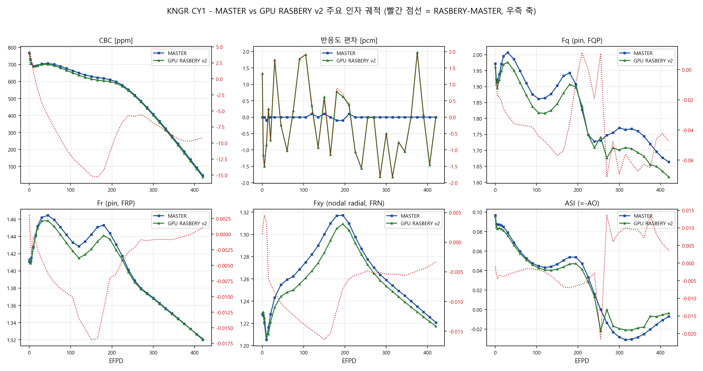
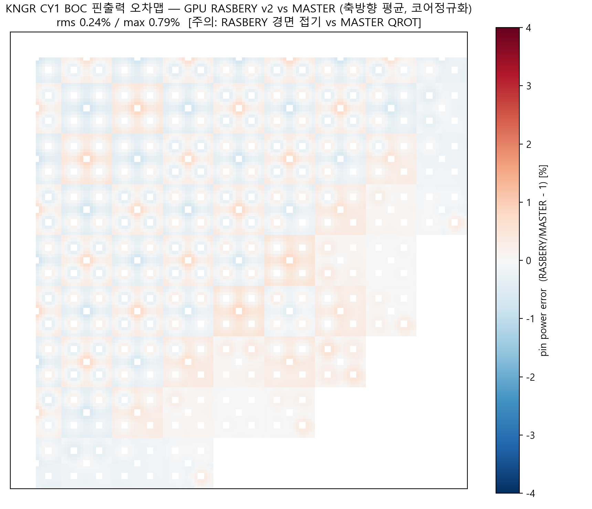
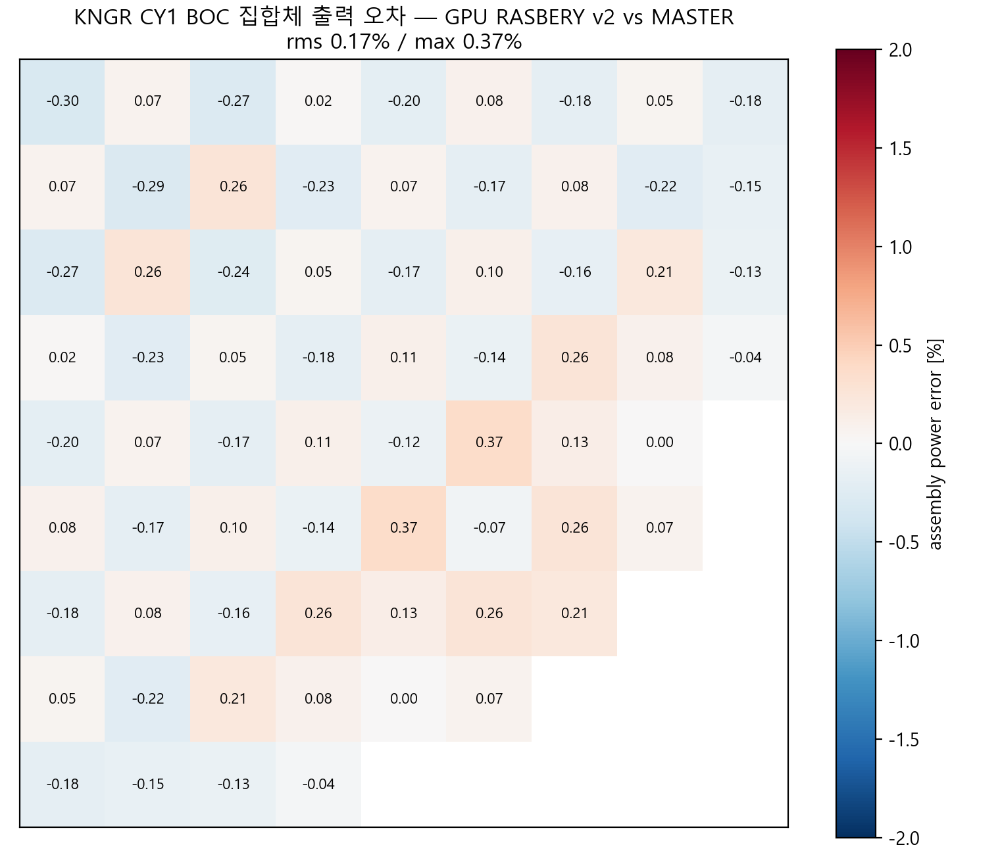
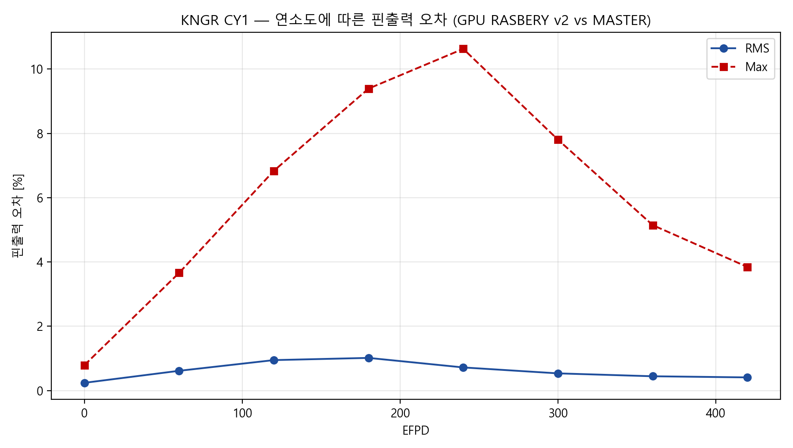

# MASTER vs GPU RASBERY 종합 비교계산 보고서

**작성일**: 2026-08-24
**RASBERY 버전**: `codex/single-gpu-batch-dispatch-v2` (= `aedae80` 리팩토링 트리 + CMFD 지오메트리 캐시 `1a81e95` + wiel_finalize 3-lane/CPU 스탬프/pinning 게이트 `98ce5ae`) — GitHub `allusion127/gpu` push됨
**실행 환경**: 238 서버 GPU0 (RTX PRO 6000 Server, sm_120), gcc13 + CUDA 13.0, `CUDA_VISIBLE_DEVICES=0`
**MASTER 기준**: MASTER 4.0 (KNGQ01 덱, CBC search, DeCART 공유 라이브러리), 단일런·W16 병렬 수치는 181 PC(CPU) 실측 기록

---

## 1. 비교 대상 및 계산 조건

| 항목 | 정확도 비교 | 속도 비교 (M64) |
|---|---|---|
| 벤치마크 | KNGR(APR1400 PSAR) CY1, 35상태 자연 EOC 연소 | APR1400 CY02 64덱 (51상태/덱) |
| 격자 | 쿼터 313×27 = 8,451 노드, NG=2, 핀 16×16 | 동일 |
| RASBERY 설정 | `RASBERY_PPR_MODE=master`, `RASBERY_PC_MODE=decart`, GPU 전체 스택(CMFD sweep + XSRECON + FLATXS + NODAL FULL + 배치 아레나) | 동일 + `--batch-mode 64`, 64 호스트 워커 |
| MASTER 설정 | KNGQ01, SEARCH=2(CBC), XE=1/SM=2 | W16 (16병렬, 181 CPU) 기록치 |
| 접기 방식 | RASBERY 경면(mirror) 접기 vs MASTER QROT — 대각 핀 비교에 미세 규약차 존재 | — |

양 코드 모두 **CBC search**(임계 붕산 탐색) 모드로 정합 확인됨. RASBERY 결과(`cand_v2.h5`)는 기준 골든(`ref_aedae80.h5`)과 500/500 데이터셋 bit-identical — 즉 v2 최적화는 수치에 영향이 전혀 없다.

---

## 2. 계산 정확도

### 2.1 노심 주요 인자 (33개 공통 상태, EFPD 0~420)

| 인자 | max\|Δ\| | RMS | 비고 |
|---|---|---|---|
| CBC [ppm] | **15.31** | 8.92 | 최대 편차 위치 = 165 EFPD (Gd 소진 구간), EOC에서 −9.2 ppm |
| 반응도 [pcm] | **1.97** | 1.09 | 탐색 잔차 수준 (양 코드 모두 CBC search 미세 진동) |
| AO/ASI | 0.022 | 0.007 | |
| Fq (핀, FQP) | 0.071 | 0.043 | 상대 ~4 % 미만 |
| Fr (핀, FRP) | 0.017 | 0.007 | |
| Fxy (노달, FRN) | 0.016 | 0.009 | |



상태별 상세(발췌; 전체는 `kngr_v2_vs_master.csv`):

| EFPD | ΔCBC [ppm] | Δρ [pcm] | ΔAO | ΔFq | ΔFr |
|---|---|---|---|---|---|
| 0 (BOC) | +2.19 | +1.33 | 0.001 | −0.011 | +0.003 |
| 60 | −7.58 | −1.03 | 0.002 | −0.037 | −0.008 |
| 150 | −15.15 | +0.52 | 0.005 | −0.057 | −0.017 |
| 165 (최대) | **−15.31** | −1.14 | 0.007 | −0.054 | −0.017 |
| 240 | −5.70 | −1.56 | 0.003 | −0.019 | −0.003 |
| 300 | −6.87 | −0.50 | −0.009 | −0.069 | −0.001 |
| 420 (EOC) | −9.18 | −0.00 | −0.004 | −0.047 | +0.001 |

### 2.2 핀출력 분포

**BOC**: RMS **0.24 %** / max **0.79 %** (축방향 평균, 코어 정규화, 연료 69개 집합체 전 핀).
**집합체 출력(BOC)**: RMS **0.18 %** / max **0.37 %**.




**연소도 의존성**:

| EFPD | 핀 RMS [%] | 핀 max [%] |
|---|---|---|
| 0 (BOC) | 0.24 | 0.79 |
| 60 | 0.61 | 3.66 |
| 120 | 0.95 | 6.83 |
| 180 | **1.02** | 9.39 |
| 240 | 0.72 | **10.63** |
| 300 | 0.53 | 7.80 |
| 360 | 0.44 | 5.15 |
| 420 (EOC) | 0.41 | 3.84 |



**Gd 소진 구간(60~300 EFPD) 편차의 귀속**: CBC 최대 15 ppm과 핀 max 오차의 팽창은 모두 Gd 가연성 독물 소진 창에서 발생하며, 캠페인 검증(2026-08-23 종결)에서 **MASTER의 BP01 독립 처리 기구가 공유 DeCART 라이브러리와 이탈**하는 것으로 귀속되었다. RASBERY의 Gd 수밀도는 라이브러리 궤적을 0.02 % 이내로 추적함을 확인했고, 해당 차이는 문서화 후 수용하기로 결정된 항목이다(핀 오차 캠페인 기록 참조). Gd 창 밖(BOC·EOC)에서는 핀 RMS 0.24~0.41 %로 수렴한다.

### 2.3 수치 재현성 체계

- CPU 경로와 GPU 경로는 **bit-identical** (gcc asm 마이닝 fma 마스크, `--fmad=false`, 고정청크 순서보존 리덕션).
- v2 최적화(그래프 반복 배칭, 노달 FULL 상주, CMFD 캐시, wiel_finalize 3-lane)는 골든 대비 **500/500 데이터셋 bit-exact** — keff/CBC Δ = 0.0.
- 64덱 동시 배치 실행도 단독 실행과 **bit-identical** (708/708 데이터셋, 24워커 재활용 구성 포함).

---

## 3. 계산 속도

### 3.1 단일 실행 (KNGR CY1, 35상태)

| 구성 | 181 (Max-Q) | 238 (Server GPU0) |
|---|---|---|
| RASBERY CPU만 | 98.6 s | 175.8 s |
| RASBERY GPU 전체 스택 | 69.1 s | 88.9 s |
| RASBERY v2 (금일 골든런) | — | 94.3 s¹ |
| **MASTER (CPU 단일, 181)** | **27.2 s** | — |

¹ 골든 검증 겸용 런(HDF5 전체 기록 포함), 한산 호스트.

단일 실행에서는 MASTER CPU가 여전히 약 3.1배 빠르다. KNGR 쿼터(8,451노드)는 GPU 스레드슬롯의 ~2 %만 채우는 소형 문제로, 커널 지연(137 µs/콜)이 지배하기 때문이다. **GPU의 설계 목표는 단일런이 아니라 동시 실행 처리량이다(3.2).**

### 3.2 64 동시 실행 처리량 (M64, CY02 64덱, 238 GPU0)

| 구성 | wall [s] | 처리량 [cases/h] | 비고 |
|---|---|---|---|
| 기존 캠페인 (sm_75 JIT 하이브리드) | 1565.9 | 147.1 | |
| 리팩토링 (native sm_120 + FULL + 아레나) | 1361.9 | 169.2 | |
| **v2 (wiel_finalize 3-lane + eps sync 제거)** | **1172.8~1174.7** | **196.2~196.5 (중앙값 196.2)** | 3회 반복 산포 0.16 %, 폴백 0 |
| (참고) v2 A24: 24워커 재활용·pageable | 2322.4 | 99.2 | 정확성 게이트용 구성 |
| **MASTER W16 (181 CPU 16병렬, 기록치)** | — | **216–218** | 다른 하드웨어(181 CPU) 실측 기록 |

- v2 처리량 이득: 기존 169.2 → **196.2 cases/h (+16 %)**. GPU0 이용률 78~93 %, CMFD 아레나 평균 집계 폭 22.0/64, 노달 아레나 6.33/64, graph fallback 0.
- **MASTER W16 대비 90~91 % 도달** — 잔여 격차 ~10 %는 CMFD 행렬조립(setls/upddhat)의 GPU 배치화(B단계), HDF5 writer 스레드 분리(D단계) 등 계획된 후속 작업 대상이다.
- 주의: MASTER W16은 181 PC(CPU 24스레드급) 기록치로 서버가 다르다. 동일 하드웨어 정면 비교가 아니라 "각 코드의 현실 운용 구성" 비교다.

### 3.3 처리량 이력

```
147.1 (캠페인 기준) → 169.2 (+15 %, GPU-friendly 리팩토링)
                    → 196.2 (+16 %, v2: wiel_finalize 3-lane + eps 드레인 제거)
                    → 목표 216–218 (MASTER W16) — 잔여 격차 ~10 %
```

---

## 4. 방법론 요약 (CPU-GPU 역할 분담)

| 구성요소 | 담당 | 방식 |
|---|---|---|
| CMFD BiCG 내부루프 | GPU | CUDA Graph 1회 발사/스윕, 64슬롯 배치 아레나, 디바이스 Wielandt |
| 노달 SENM (5커널) | GPU | FULL 상주 파이프라인, (lk,ig) 스레드 분할, 아레나 집계 |
| XS 재구성/FLATXS | GPU | 노드 병렬, 연료/비연료 사전 컴팩션 |
| 수렴 판정·탐색(CBC)·로드커스핑·TH | CPU | 분기(IF) 로직은 호스트 전담 |
| 워커 오케스트레이션 | CPU | 64 OMP 드라이버 스레드, 기회적 랑데부, 단일 발사자 선출 |
| 비트 재현 | 공통 | fma 마스크·고정청크 리덕션·`--fmad=false`로 CPU=GPU bit 일치 |

상세 구조·커널 인벤토리·스테이지별 타이밍은 `GPU_Rasberry/rasbery_gpu/docs/GPU_RASBERY_METHODOLOGY_BENCHMARK_20260824_KO.md` 참조.

---

## 5. 결론

1. **정확도**: 반응도 max 2.0 pcm, CBC max 15.3 ppm(Gd 창, MASTER BP01 귀속·수용), BOC 핀 RMS 0.24 %/EOC 0.41 % — 노심설계 코드 간 비교로서 충분한 일치. GPU 경로는 CPU와 bit-identical이므로 GPU화로 인한 정확도 손실은 **0**.
2. **속도**: 단일런은 MASTER CPU가 3.1배 빠르나(소형 문제 지연 지배), 동시 64실행 처리량은 GPU 1장으로 **196.2 cases/h** — MASTER 16코어 병렬(216–218)의 **91 %**. 다중 케이스 스크리닝(LP 탐색, 사이클 최적화) 워크로드에서 GPU 1장 ≈ CPU 16코어로 실용 단계에 진입.
3. **잔여 격차 ~10 %**: CMFD 조립 GPU 배치화, wiel 병렬 확대, HDF5 writer 분리(B/C/D단계)로 해소 예정.

---

## 부록 A. 데이터·재현 경로

| 항목 | 경로 |
|---|---|
| RASBERY v2 결과 (h5) | 238 `~/kngr_238/cand_v2.h5` (로컬 사본: scratchpad `dispatch_test\cand_v2.h5`) |
| MASTER 기준 (MAS_SUM/PPI) | scratchpad `kngr_mas_sum.txt`, `kngr_mas_ppi_boc.txt`, `mas_ppi_0060~0431.61.txt` |
| 상태별 비교 CSV | scratchpad `dispatch_test\kngr_v2_vs_master.csv` |
| 비교 스크립트 | `rasbery_gpu/tools/compare_master_rasbery.py`, scratchpad `make_v2_master_cmp.py` |
| M64 측정 로그 | 238 `~/gpu_dispatch_test/benchmark/m64_manual/*_b64_v2_r{0,1,2}*` |
| 그림 | 본 폴더 `fig19_v2_params.png`, `fig20_v2_pin_boc.png`, `fig21_v2_pin_trend.png`, `fig22_v2_asm_boc.png` |

## 부록 B. M64 실측 원본 (요약)

| 반복 | wall [s] | cases/h | rc | FAIL | graph_fallbacks | GPU0 util 샘플 |
|---|---|---|---|---|---|---|
| r0 (오전) | 1174.70 | 196.14 | 0 | 0 | 0 | — |
| r1 | 1172.78 | 196.46 | 0 | 0 | 0 | 91/89/82/87/93 % |
| r2 | 1174.29 | 196.20 | 0 | 0 | 0 | 83/82/84/78/88 % |

`[RASBERY][BATCH_HOST] {"jobs":64,"arena_width":64,"host_threads":64,"visible_cpus":24,"host_pinning":true}` — 전 반복 동일. GPU1 전 과정 미접촉(1 MiB/0 %).
