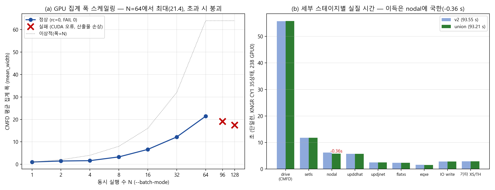

# 노달 리팩토링 검증·MASTER 비교·병목 분석 보고서

**작성일**: 2026-08-25
**검증 대상**: 사용자 push 브랜치 2종 (deep-research 보고서 기반 리팩토링, base = v2 `c9661c4`)
- `codex/nodal-constant-hotpath-refactor` (`e6cc601`) — CPU측: updateConstant 상수커널 분리(NodalConstantKernel.h) + dirty epoch 집계
- `codex/nodal-mat-even-xs-residency` (`7d98d64`) — GPU측: Mat/Even 커널 융합(5→4커널) + XS 업로드 byte-exact 미러(CudaTransferMirror.h) + 배치당 할당 제거

**검증 환경**: 238 서버 GPU0 (RTX PRO 6000 Blackwell Server, sm_120), gcc13+CUDA 13, 전 런 한산 조건(load<8)

---

## 1. 종합 판정

| 게이트 | 결과 |
|---|---|
| 코드 검토 (라인 단위 bit-안전성) | **양 브랜치 SAFE** — FP 순서 변경 0건, 레이스 0건 |
| union 병합 (두 브랜치 + v2) | 무충돌 (파일 disjoint), `acd27af` |
| 빌드 (CUDA 13/sm_120) | PASS |
| 골든 단일덱 (vs `ref_aedae80.h5`) | **PASS — 500/500 bit-identical**, keff/ppm Δ=0 |
| M64 배치 일관성 (candidate_0031) | **PASS — 708/708 bit-identical** |
| graph/drive fallback, slot refusal | 전부 0 |
| MASTER 비교 (KNGR CY1) | 기존과 동일 (§3) |
| M64 처리량 | 197.8 cases/h (+0.8 % vs v2 196.2) |
| **병렬 폭 스케일링 N>64** | **FAIL — N=96/128에서 CUDA 오류·산출물 손상 (§6)** |

## 2. 커밋 검토 요약 (opus 라인 검토)

**상수 핫패스(e6cc601) — SAFE.** 신규 헤더의 계수식(eta/mu/tau/diagD/bfcff 등)을 원본과 토큰 단위 대조 — 전부 동일. 구조 변경 2건(`2*out.eta2`, `1.0/out.diagD`)은 double 저장→재적재 생략일 뿐으로 SSE/AVX 경로에서 bit-무해. dirty-epoch은 재계산을 건너뛰는 경우가 없고(노드별 판정 불변), 오히려 **기존의 `++_const_generation` 데이터 레이스(UB)를 제거**함. 소비자(`!=` 비교)도 stride 축소에 무해. 정적 상태 없음 → 64 Driver 동시 실행 안전.

**Mat/Even 융합+XS 미러(c5900cb, 7f508e2) — SAFE.** 핵심 검증: Even 커널의 `nvMatM` 호출 11곳 전수 확인 — **모두 자기 노드(lk)의 Mat 출력만 읽음**(이웃 읽기 0건, mu/tau/matMI 사용 0건) → 커널 경계 제거는 스레드 내부 순차화일 뿐, 장벽 불필요·레이스 없음. 스레드→노드 매핑 동일, `--fmad=false`+명시적 fma 마스크 체계 불변 → bit-exact 보장. 크로스 노드 의존이 실재하는 Even→Jnet 경계는 유지(올바름). XS 미러는 `memcmp`(byte-exact, ±0/NaN 페이로드 구분), 슬롯 키 정확, 재입주 시 무효화, H2D 실패 시 fail-closed(arena 영구 off), 신규 pinning 없음.

잔여 권고(비차단): ①`apply-*` 파일명 정정(실제로는 적용 안 함 — 오독 유발) ②상수커널 테스트의 legacy 참조를 구버전 소스에서 유도 ③`Nodal.h` BOM 제거가 무설명으로 동반됨 ④위험했던 auto-commit CI 패턴은 **재발하지 않음**(최종 워크플로는 read-only 검사만).

## 3. MASTER 비교계산 (APR1400/KNGR CY1 PSAR)

union 산출물(`cand_nodal_union.h5`)이 골든과 **bit-identical**이므로 정확도는 기존 비교와 정확히 동일하며, 기록용으로 재실행해 확인함:

| 인자 | max\|Δ\| | 비고 |
|---|---|---|
| CBC | 15.31 ppm | Gd 창(165 EFPD), MASTER BP01 귀속(수용 결정) |
| 반응도 | 1.97 pcm | CBC search 잔차 수준 |
| AO / Fq / Fr | 0.022 / 0.071 / 0.017 | |
| 핀출력 BOC | RMS 0.24 % / max 0.79 % | EOC RMS 0.41 % |

상세(그림·연소도 트렌드·집합체 오차)는 `MASTER_vs_RASBERY_COMPARISON_20260824_KO.md` 참조 — 수치 전부 유효.

## 4. 세부 코드별 실질 시간 — 단일런 (KNGR CY1 35상태, 238 GPU0, 실측)

양 빌드 동일 문제(outer 21,271회, CMFD 디바이스 콜 301,334회, graph 발사 112,459회 — 카운터까지 완전 일치 = 결정론 확인).

| 스테이지 | union [s] | v2 [s] | Δ | wall 비중 |
|---|---:|---:|---:|---:|
| **drive (CMFD BiCG+랑데부)** | **55.76** | 55.68 | +0.08 | **59.8 %** |
| **setls (CMFD 행렬조립, CPU)** | **11.80** | 11.81 | −0.02 | **12.7 %** |
| nodal (GPU FULL) | 5.84 | 6.20 | **−0.36** | 6.3 % |
| upddhat (CPU) | 5.74 | 5.73 | +0.01 | 6.2 % |
| IO write (HDF5) | 2.83 | 2.82 | ±0 | 3.0 % |
| updjnet (CPU) | 2.53 | 2.54 | ±0 | 2.7 % |
| flatxs (GPU) | 2.36 | 2.37 | ±0 | 2.5 % |
| eqxe (XS, 3,512콜/2,970만 노드) | 1.55 | 1.58 | −0.03 | 1.7 % |
| set_boron / update_th / update_burnup / updpsi / cusping | 2.94 | 2.95 | ±0 | 3.2 % |
| **TOTAL DRIVER TIME** | **93.21** | **93.55** | **−0.34** | 100 % |

- 리팩토링 이득은 **nodal 버킷에 정확히 국한**(−0.36 s = 전체 이득 −0.34 s와 일치) — 주장한 대상만 빨라졌고 다른 스테이지·반복수·물리 불변. `mat_even_fused:1` 수신 확인, v2에는 해당 필드 없음(구조적으로 구분됨).
- 세부 카운터: bulk H2D 358,648콜/78.1 GB(그중 91,188콜 스킵), D2H·status·sync 각 91,261콜, BiCG 조기수렴 탈출 42,716, overrun 반복 63,710. HDF5 락 대기 0.007 ms(단일런 무시 가능).

## 5. 병렬(M64) 병목 — 64덱, width 64

| 항목 | union | v2 (전일) |
|---|---|---|
| wall / 처리량 | **1165.0 s / 197.8 cases/h** | 1174.7 s / 196.2 |
| CMFD 집계 폭 | 21.42/64 (도착 간격 EWMA 3,601 µs) | 21.96/64 |
| 노달 아레나 폭 | **7.84**/64 (배치 258,951회) | 6.33/64 |
| **XS 미러 효과** | **H2D 50.8 GB 전송 / 1,047.4 GB 스킵 = 95.4 % 절감** | (미러 없음) |
| GPU0 이용률 | 73~99 % | 78~93 % |
| 폴백/실패 | 전부 0, 708/708 bit-exact | 동일 |

**해석**: XS 미러가 노달 H2D의 95 %를 제거해 노달 배치 폭이 6.33→7.84로 상승했으나, 전체 처리량 이득은 +0.8 %에 그침 — **병목이 노달 전송이 아니라 CMFD 도착 폭(21/64)과 CPU 잔류 조립(setls+upddhat+updjnet = 단일런 기준 21.6 %)에 있음을 역으로 실증**. 검토에서 우려한 memcmp 비용(임계경로 동기 비교)은 95 % 스킵률 덕에 순이득으로 판명.

## 6. 병렬 효율 매트릭스 (N = 1~128, union 빌드)

| N | wall [s] | rc | FAIL | CMFD 평균 폭 | 폭/N | cases/h | MaxRSS |
|---:|---:|---:|---:|---:|---:|---:|---:|
| 1 | 170.5 | 0 | 0 | 1.00 | 100 % | 21.1 | 0.6 GB |
| 2 | 508.7 | 0 | 0 | 1.44 | 72 % | 14.2 | 0.9 GB |
| 4 | 1577.7 | 0 | 0 | 1.60 | 40 % | 9.1 | 1.5 GB |
| 8 | 1919.0 | 0 | 0 | 3.28 | 41 % | 15.0 | 2.6 GB |
| 16 | 2559.0 | 0 | 0 | 6.62 | 41 % | 22.5 | 4.9 GB |
| 32 | 3895.7 | 0 | 0 | 12.17 | 38 % | 29.6 | 9.6 GB |
| **64** | **1165.0** | 0 | 0 | **21.42** | 33 % | **197.8** | 18.8 GB |
| 96 | 5560.6 | **1** | **52** | 19.03 | 20 % | (무효) | 18.9 GB |
| 128 | 3663.2 | **1** | **94** | 17.40 | 14 % | (무효) | 18.9 GB |

**읽는 법 주의**: N=1~32의 cases/h는 서로 다른 덱 부분집합(비용 편차 큼)이라 순수 효율 곡선이 아님 — N=32(덱 0~31)가 N=64보다 오래 걸리는 것은 덱 32~63이 평균적으로 훨씬 가볍기 때문. **덱 내용과 무관한 청정 신호는 CMFD 평균 폭**: 1.0→21.4로 단조 상승, **N=64에서 최대**.

**N>64 실패 (핵심 발견)**: N=96에서 52덱, N=128에서 94덱 실패 — `cudaMemcpyAsync invalid argument`(33/30건), `resource already mapped`(10/8건) 등. 인덱스 64 이상(중복 덱 랩어라운드 슬롯)은 전부 11 KB 스텁. RAM은 무관(18.9/240 GB). 원인 후보 2개가 동시에 걸려 분리 불가: ①폭>64 자체의 자원 한계 ②**동일 입력 경로를 두 슬롯이 동시에 여는 중복**(덱이 64개뿐이라 96/128은 필연적 재사용) — 다만 폭 자체도 19.0/17.4로 64보다 퇴행해 자원 압박이 실재함을 시사. **실무 결론: 현 빌드에서 `--batch-mode`는 64가 안전 상한이자 최적점.** (전일 발견한 host_threads<jobs pinning 버그와 동족의 등록 계열 오류로 추정 — 후속 격리 실험 필요: 128개 고유 덱 또는 전 슬롯 단일 덱.)

## 7. 병목 진단 종합

**단일런 (93.2 s)**
1. **drive 59.8 %** — 커널 발사 지연 지배(301,334 디바이스 콜). 근본 해소는 outer 전체 그래프화.
2. **CPU 잔류 조립 21.6 %** — setls 12.7 + upddhat 6.2 + updjnet 2.7 %. deep-research 보고서의 1순위(CMFD assembly 배치 GPU화) 그대로 유효 — 이번 리팩토링은 이 항목을 건드리지 않았음.
3. nodal은 6.3 %까지 축소 — **노달은 더 이상 주 병목이 아님.**

**병렬 M64 (197.8 cases/h)**
1. **CMFD 도착 폭 21.4/64 (34 %)** — 케이스별 CPU 경로 길이 편차가 랑데부 폭을 제한. setls/upddhat GPU화가 CPU 경로를 줄여 폭을 올리는 것이 MASTER(216–218) 돌파의 주 경로.
2. XS 미러로 노달 H2D 95 % 제거 완료 — 전송은 더 이상 병목 아님.
3. N>64 확장은 현재 차단(§6) — 폭 확장 전에 등록/자원 계열 버그 격리 필요.

## 8. 권고

1. **양 브랜치 병합 채택 가능** — 전 게이트 PASS. 단일런 −0.4 %, M64 +0.8 %의 실이득 + 데이터 레이스 제거 + H2D 95 % 절감.
2. 다음 성능 단계는 기존 로드맵 그대로: **CMFD assembly(setls/upddhat/updjnet) 배치 GPU화** — 단일런 21.6 % 직접 절감 + M64 도착 폭 상승의 이중 효과. HDF5 writer 분리는 그 다음.
3. N>64 원인 격리 실험(고유 덱 128개 or 단일 덱 반복)을 assembly 작업과 병행 권장.
4. 비차단 정리: apply-* 파일명, 상수커널 테스트 참조 강화, BOM.

## 부록 — 데이터 경로

- 서버: `~/gpu_dispatch_test` (branch `nodal-union` = `acd27af`), 로그 `~/gpu_dispatch_test/benchmark/m64_manual/{run_scale*.log, run_b64_union.log, out_scale*/, out_b64_union/}`
- 로컬: scratchpad `dispatch_test\{cand_nodal_union.h5, kngr_union_vs_master.csv, b64_union_candidate_0031.h5}`
- 수신 원문(occupancy/NODAL BATCH/XS PHASE/OUTER PHASE JSON)은 각 run 로그에 보존
