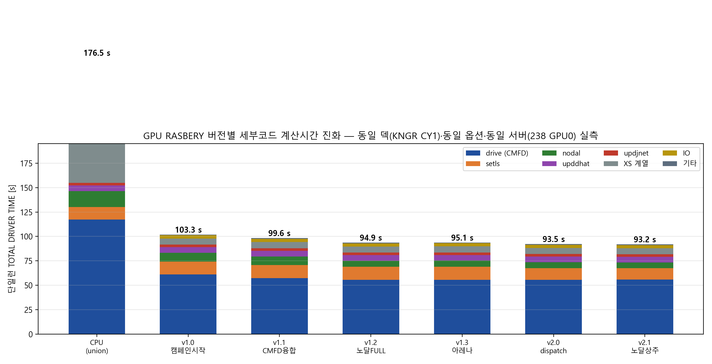

# GPU RASBERY 버전 관리 및 세부코드 시간 진화

**작성일**: 2026-08-25 | **저장소**: https://github.com/allusion127/gpu (annotated tag로 관리)

## 1. 버전 체계

규칙: `vMAJOR.MINOR-<슬러그>` annotated tag. MAJOR = 아키텍처 세대(1=GPU 캠페인, 2=one-GPU dispatch 이후), MINOR = 검증 통과한 기능 단위. 태그는 **골든 bit-exact 게이트(500/500) 통과 시점에만** 부여.

| 태그 | 커밋 | 내용 | M64 [cases/h] |
|---|---|---|---|
| `v1.0-campaign-base` | `048dc99` | 캠페인 시작: CMFD sweep + XSRECON + FLATXS + 하이브리드 노달, PPR master, gd_avg | — |
| `v1.1-cmfd-fused` | `47704ac` | CMFD elementwise 커널 융합 + iter-batch | — |
| `v1.2-nodal-full` | `50fafbb` | 노달 FULL 상주 파이프라인, (lk,ig) 분할, phase-2 fma 마스크 | — |
| `v1.3-nodal-arena` | `aedae80` | 노달 배치 아레나(64슬롯) + 방법론 보고서 | 169.2 |
| `v2.0-one-gpu-dispatch` | `5cee42c` | CMFD 지오메트리 캐시(1a81e95) + wiel_finalize 3-lane + CPU 스탬프 + pinning 게이트 | 196.2 |
| `v2.1-nodal-residency` | `bb92058` | 노달 상수커널 분리 + Mat/Even 융합(5→4커널) + XS byte-exact 미러 | 197.8 |

## 2. 측정 프로토콜 (버전 간 완전 동일)

- 서버: 238 GPU0 (RTX PRO 6000 Blackwell Server, sm_120), gcc13 + CUDA 13, `-j 12` 빌드
- 덱: `kngr_238.json` (APR1400/KNGR CY1 PSAR, 35상태 자연 EOC, 8,451노드 NG=2)
- 옵션: `RASBERY_PPR_MODE=master RASBERY_PC_MODE=decart` + GPU 전 플래그(`RASBERY_GPU=1 _CMFD_SWEEP=1 _XSRECON=1 _FLATXS=1 _NODAL=1 _NODAL_FULL=1`) + `RASBERY_OUTER_TIMING=1 RASBERY_XS_TIMING=1` — **모든 버전에 동일 부여** (구버전은 미보유 기능 플래그를 자연 무시; 활성 암은 수신 라인으로 검증)
- 전 런 rc=0, 폴백 0, 한산 조건(1분 load ≤ 1.6), 2026-08-25 동일 세션 연속 실측

## 3. 버전별 세부코드 계산시간 (단일런, 실측 — 초)

| 스테이지 | CPU 전용¹ | v1.0 | v1.1 | v1.2 | v1.3 | v2.0 | v2.1 |
|---|---:|---:|---:|---:|---:|---:|---:|
| drive (CMFD BiCG) | 117.27 | 60.96 | **57.25** | 55.45 | 55.54 | 55.68 | 55.76 |
| setls | 13.00 | 13.25 | 13.31 | 13.42 | 13.45 | **11.81** | 11.80 |
| nodal | 16.09 | 8.96 | 8.89 | **6.19** | 6.26 | 6.20 | **5.84** |
| upddhat | 5.83 | 5.94 | 5.96 | 5.77 | 5.77 | 5.73 | 5.74 |
| updjnet | 2.59 | 2.61 | 2.61 | 2.56 | 2.56 | 2.54 | 2.53 |
| updpsi + cusping | 0.89 | 0.79 | 0.79 | 0.77 | 0.77 | 0.79 | 0.79 |
| XS 계열² | 124.42 | 6.18 | 6.18 | 6.20 | 6.21 | 6.19 | 6.14 |
| Init+IO / IO write | 0.19/2.84 | 0.49/2.84 | 0.46/2.86 | 0.46/2.85 | 0.46/2.83 | 0.51/2.82 | 0.47/2.83 |
| **TOTAL DRIVER TIME** | **176.50** | **103.30** | **99.59** | **94.94** | **95.11** | **93.55** | **93.21** |
| outer 반복수 | 21,486 | 21,849 | 21,849 | 21,271 | 21,271 | 21,271 | 21,271 |
| 최종 K-EFF / PPM | 1.000018/9.86 | 1.000011/9.80 | 1.000011/9.80 | 1.000003/10.00 | 1.000003/10.00 | 1.000003/10.00 | 1.000003/10.00 |

¹ v2.1 코드로 GPU 전부 off — GPU 총효과의 기준선. ² eqxe+flatxs+update_th+set_boron+update_burnup; CPU 전용은 GPU가 대체하는 eqxe_condense 50.5 s + eqxe_recon 25.7 s + flatxs_unrodded 30.2 s 포함(이 세 버킷이 XSRECON/FLATXS 백엔드가 제거하는 바로 그 비용).



## 4. 버전별 개선 귀속 (스테이지 단위 실측 근거)

| 전이 | Δ TOTAL | 귀속 |
|---|---:|---|
| CPU → v1.0 | **−73.2 s (−41 %)** | XS GPU화 −118 s(124→6) + CMFD sweep −56 s(117→61)가 주도, 노달 하이브리드 −7 s |
| v1.0 → v1.1 | −3.7 s | **전량 drive**(61.0→57.2) = CMFD 커널 융합 + iter-batch |
| v1.1 → v1.2 | −4.6 s | **nodal 8.9→6.2**(FULL 상주) + drive −1.8(outer 21,849→21,271 궤적 변화 동반³) |
| v1.2 → v1.3 | +0.2 s | 아레나는 단일런 경로 불변(배치 전용) — 노이즈 수준 |
| v1.3 → v2.0 | **−1.6 s** | **전량 setls**(13.45→11.81, −12 %) = CMFD 지오메트리 캐시(1a81e95). 당시 경합 wall 비교에선 가려졌던 실이득이 스테이지 실측으로 확정 |
| v2.0 → v2.1 | −0.3 s | **전량 nodal**(6.20→5.84) = 상수커널 분리 + Mat/Even 융합 + XS 미러 |
| CPU → v2.1 누적 | **−83.3 s (1.89×)** | 동일 서버 GPU 총효과 |

³ v1.2의 노달 FULL은 outer 궤적을 미세 변경(각 버전 내부 CPU=GPU bit-exact는 유지; 버전 간 최종 상태는 K-EFF 2 pcm·PPM 0.2 ppm 이내 동일).

## 5. M64 처리량 이력 (참고)

```
147.1 (sm_75 JIT 하이브리드) → 169.2 (v1.3) → 196.2 (v2.0, +16 %) → 197.8 (v2.1)
MASTER W16 기준 216–218의 91 % — 다음: CMFD assembly GPU화 (setls+upddhat+updjnet = 21.6 %)
```

## 6. 운영 규칙

1. 태그는 골든 500/500 bit-exact + 폴백 0 통과 후에만 부여; 태그 메시지에 M64 수치 기록
2. 성능 커밋과 correctness 인프라 커밋 분리 (rollback/bisect 용이)
3. 버전 간 스테이지 비교는 본 문서 프로토콜(§2)로만 — 다른 덱/서버/옵션 수치와 혼용 금지
4. 원본 로그: 238 `/tmp/run_v1{0..3}.log`, `/tmp/run_unionCPU.log` (세션 산출물, 휘발성 — 본 문서가 기록본)
